# Lab 1: Web Application Reconnaissance and Traffic Analysis with Nmap and Burp Suite

## Scope

This lab was performed in a controlled local environment using OWASP Juice Shop as the target application. All testing was conducted against a deliberately vulnerable training application hosted on an Ubuntu Victim VM.

No real user credentials were used. No live third-party systems were tested. No exploitation, brute-force attack, password spraying, credential stuffing or unauthorised testing was performed in this lab.

---

## Analyst Summary

This lab focused on initial reconnaissance and web traffic analysis against an OWASP Juice Shop target machine.

An Nmap scan identified an open web service on TCP port `3000`. Although Nmap labelled the service as `ppp?`, the returned HTTP content and browser validation confirmed that the service was hosting the OWASP Juice Shop web application.

Browser-based inspection and Burp Suite proxy interception were then used to analyse how the application handled web requests. Burp Suite successfully captured HTTP traffic between Kali Firefox and the Juice Shop application, including a login request to the `/rest/user/login` endpoint.

The captured login request showed that authentication data was submitted using a JSON request body with an email and password field. Fake test credentials were used during testing. The server returned a `401 Unauthorized` response, confirming that the submitted credentials were rejected and that authentication validation was taking place server-side.

The login endpoint was identified as a key attack surface because authentication forms are commonly targeted for credential attacks, weak password testing, brute-force attempts, credential stuffing and user enumeration. Further testing would be needed before making any conclusion about whether the endpoint is vulnerable to those issues.

---

## Objective

- Build a safe local web application testing target
- Deploy OWASP Juice Shop on an Ubuntu Victim VM using Docker
- Confirm the vulnerable web application is reachable from Kali Linux
- Use Nmap to validate the exposed service on TCP port `3000`
- Use Burp Suite to capture and inspect HTTP traffic
- Review a baseline login request and failed authentication response
- Document setup, exposure, evidence and defensive observations in a professional analyst-style format

---

## Lab Environment

| Component | Details |
|---|---|
| Attacker Machine | Kali Linux |
| Target Machine | Ubuntu Victim |
| Vulnerable Application | OWASP Juice Shop |
| Hosting Method | Docker container |
| Target IP | `192.168.11.131` |
| Target Port | `3000/tcp` |
| Tools Used | Docker, Nmap, Firefox, Burp Suite Community Edition |
| Scope | Private local lab only |

---

## Methodology

1. Installed and verified Docker on the Ubuntu Victim VM.
2. Deployed OWASP Juice Shop using Docker.
3. Identified the Ubuntu Victim IP address.
4. Accessed Juice Shop from Kali Linux using Firefox.
5. Ran an Nmap scan against TCP port `3000`.
6. Ran Nmap service detection and saved the raw scan output.
7. Configured Kali Firefox to proxy traffic through Burp Suite.
8. Captured HTTP requests and responses between the browser and the Juice Shop application.
9. Submitted fake login credentials to observe the structure of the authentication request.
10. Reviewed the login request, response code and endpoint behaviour.
11. Saved screenshots and raw Nmap output as evidence.
12. Mapped the activity to relevant MITRE ATT&CK techniques.

---

## Commands Used

### Verify Docker

```bash
sudo docker ps
```

### Run OWASP Juice Shop

```bash
sudo docker run -d --name juice-shop -p 3000:3000 bkimminich/juice-shop
```

### Identify Ubuntu Victim IP Address

```bash
ip a
```

### Confirm Port 3000 Is Open

```bash
nmap -p 3000 192.168.11.131
```

### Run Service Detection and Save Output

```bash
nmap -sV -p 3000 192.168.11.131 -oN lab01-nmap-service-scan.txt
```

---

## Evidence

### 1. Docker Installed

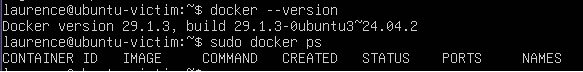

Docker was installed and confirmed on the Ubuntu Victim VM.

---

### 2. Juice Shop Running

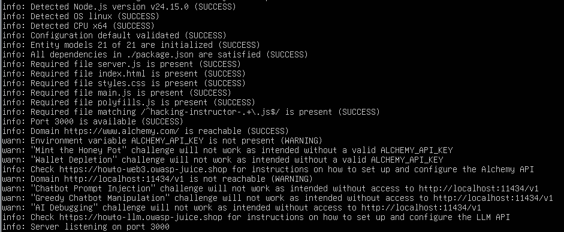

OWASP Juice Shop successfully started and confirmed it was listening on port `3000`.

---

### 3. Juice Shop Running in Detached Mode

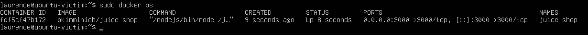

The Juice Shop container was later started in detached mode so the terminal could be reused.

---

### 4. Ubuntu Victim IP Address

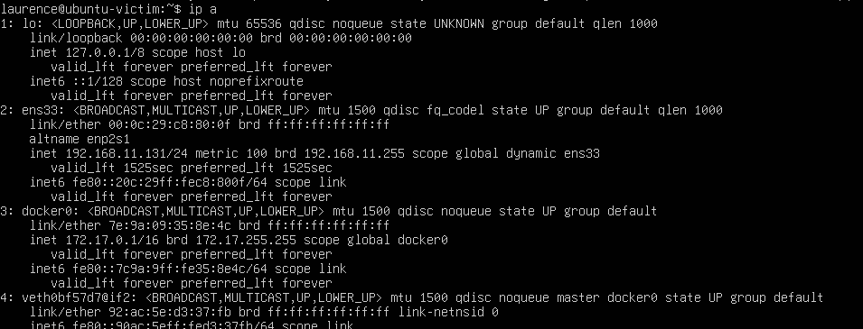

The Ubuntu Victim VM was assigned the IP address `192.168.11.131`.

---

### 5. Juice Shop Loaded from Kali

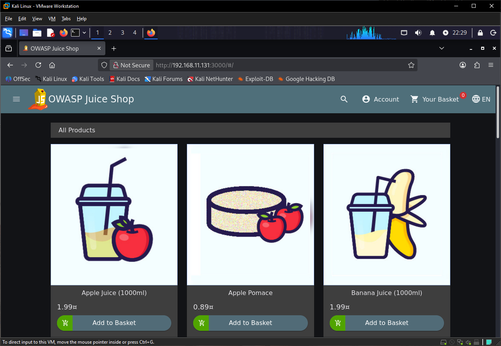

Kali Linux successfully accessed the Juice Shop web application over the lab network.

---

### 6. Nmap Port 3000 Scan

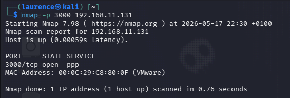

Nmap confirmed that TCP port `3000` was open on the Ubuntu Victim host.

---

### 7. Nmap Service Detection

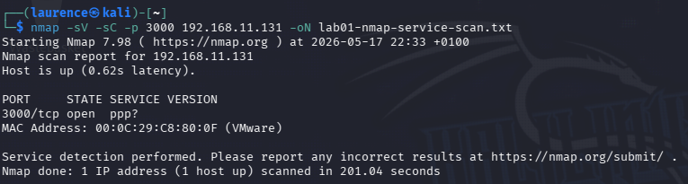

Nmap service detection confirmed that the target was responding on port `3000`. Nmap labelled the service as `ppp?`, but the returned HTTP content and browser validation confirmed the application was OWASP Juice Shop.

Raw scan output is saved here:

[labs/lab-01-juice-shop-recon-traffic-capture/lab01-nmap-service-scan.txt](labs/lab-01-juice-shop-recon-traffic-capture/lab01-nmap-service-scan.txt)

---

### 8. Burp HTTP History

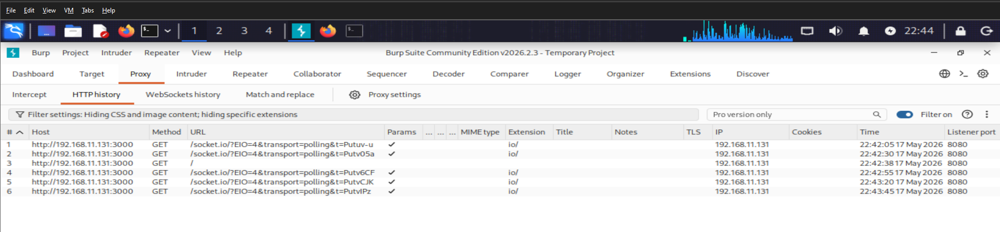

Burp Suite captured HTTP requests from Kali Firefox to the Juice Shop application.

---

### 9. Homepage Request Details

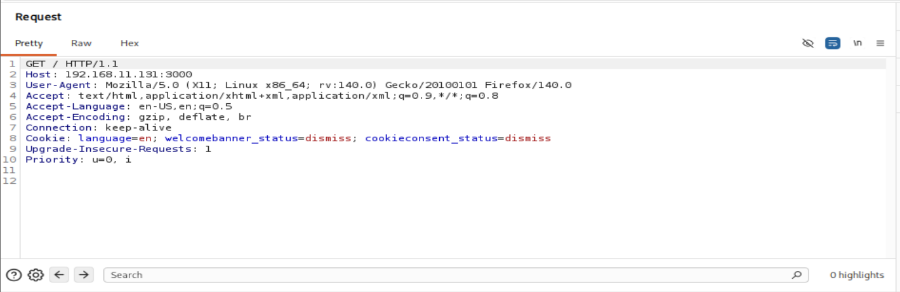

The captured request showed a standard `GET /` request to `192.168.11.131:3000`.

---

### 10. Login Request Analysis

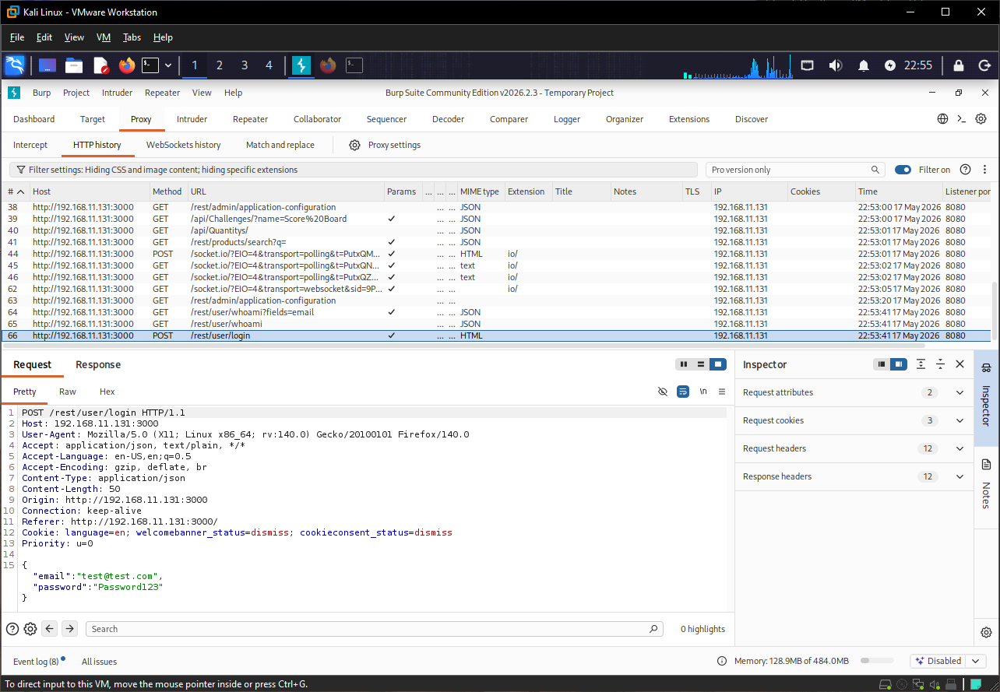

Burp Suite captured a `POST` request to the Juice Shop login endpoint:

```text
/rest/user/login
```

The request used the following content type:

```text
Content-Type: application/json
```

The login data was submitted in a JSON body using the following structure:

```json
{
  "email": "test@example.com",
  "password": "testpassword"
}
```

Fake test credentials were used during the lab. No real credentials were entered.

This request is important because it shows how the application accepts authentication data, which endpoint processes login attempts and what data structure is expected by the server.

---

### 11. Failed Login Response

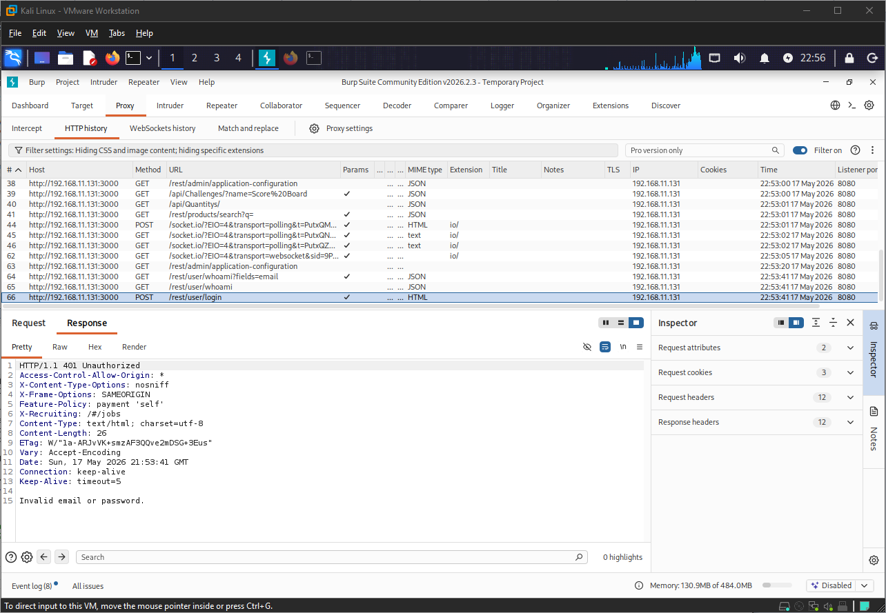

The application responded with:

```text
401 Unauthorized
```

This confirmed that the credentials were rejected and that authentication checks were being handled server-side.

The `/rest/user/login` endpoint is a high-value area for future testing because weak authentication controls can expose applications to credential stuffing, brute-force attempts, password spraying and account enumeration.

No brute-force attack or credential attack was performed in this lab.

---

## Key Observations

| Finding | Evidence | Risk |
|---|---|---|
| Web service exposed on port `3000` | Nmap identified TCP port `3000` as open and responding with HTTP traffic | Exposed web services increase the attack surface and should be assessed for vulnerabilities |
| Web application accessible in browser | OWASP Juice Shop loaded successfully from Kali Firefox | Public-facing web applications may contain authentication, input validation or session management weaknesses |
| Burp Suite successfully intercepted traffic | HTTP requests and responses were captured through the proxy | Intercepted traffic allows analysts to inspect request structure, headers, endpoints and application behaviour |
| Login endpoint identified | Burp captured a `POST` request to `/rest/user/login` | Login endpoints are common targets for credential attacks and should have strong protections |
| JSON authentication request observed | Login data was submitted using `Content-Type: application/json` with an email and password field | Understanding request structure helps identify how authentication data is transmitted and where testing should focus |
| Invalid login response observed | Server returned `401 Unauthorized` after fake credentials were submitted | Confirms server-side authentication validation, but further testing would be needed to assess rate limiting and error handling |

---

## Risk Explanation

In a real organisation, an exposed web application should be carefully tested, hardened and monitored. Open application ports can reveal services to attackers, and authentication endpoints are common targets because they handle user identity, credentials and session creation.

This lab did not exploit the application. It focused on safe setup, reconnaissance, traffic capture and baseline request analysis. The exploitation stage is documented separately in Lab 4.

The main risk identified in this lab is not that a confirmed vulnerability was exploited. The risk is that the exposed web application and its login endpoint represent areas that would need deeper security testing before being trusted in a production environment.

---

## Remediation Advice

The Juice Shop application exposed a web service on port `3000`, including an authentication endpoint at `/rest/user/login`. Authentication endpoints should be treated as high-risk areas because they are commonly targeted by attackers.

| Area | Recommendation |
|---|---|
| Authentication protection | Apply rate limiting to the `/rest/user/login` endpoint to reduce the risk of brute-force and credential stuffing attacks |
| Account lockout | Temporarily lock, delay or challenge accounts after repeated failed login attempts |
| Error handling | Use generic login failure messages that do not reveal whether the email address or password was incorrect |
| Logging and monitoring | Log failed login attempts, repeated authentication failures, unusual IP activity and suspicious request patterns |
| Security headers | Review and strengthen HTTP security headers such as `Content-Security-Policy`, `X-Frame-Options` and `Strict-Transport-Security` where appropriate |
| HTTPS | Ensure authentication traffic is protected with HTTPS in real-world deployments |
| Input validation | Validate and sanitise user-supplied input on all authentication-related endpoints |
| Container security | Keep container images, application dependencies and host packages updated |
| Exposure control | Restrict access to development or test applications so they are not unnecessarily exposed to wider networks |
| Authorised testing | Ensure security testing is only performed with clear authorisation and within an agreed scope |

Further testing should be performed before making any conclusion about whether the login endpoint is vulnerable to brute-force, credential stuffing, password spraying, account enumeration or session management weaknesses.

---

## MITRE ATT&CK Mapping

| Technique | ID | Relevance |
|---|---|---|
| Active Scanning | `T1595` | Nmap was used to actively scan the target and identify an exposed service in the lab environment |
| Network Service Discovery | `T1046` | The scan identified an open service running on TCP port `3000` |
| Application Layer Protocol: Web Protocols | `T1071.001` | Burp Suite captured HTTP web traffic between the browser and the Juice Shop application |
| Exploit Public-Facing Application | `T1190` | The Juice Shop web application represents a public-facing attack surface, although exploitation was not performed in this lab |

`T1110 Brute Force` was not included because no brute-force testing, password spraying or repeated login attempts were performed during this lab.

---

## Lessons Learned

- Docker is useful for quickly deploying vulnerable lab applications.
- Nmap can confirm whether a web service is exposed, but manual verification is still important.
- Burp Suite is valuable for inspecting how browsers communicate with web applications.
- Login requests often reveal useful structure, such as endpoint paths, request methods, content types and JSON parameters.
- A failed login response can confirm that server-side authentication checks are taking place.
- MITRE ATT&CK mapping should be accurate and should not overclaim activity that was not performed.
- Good screenshots and raw output make a cybersecurity portfolio stronger than plain notes.

---

## Conclusion

This lab successfully demonstrated basic web application reconnaissance and traffic analysis against OWASP Juice Shop.

Nmap was used to identify an exposed web service on TCP port `3000`. Burp Suite was then used to intercept and inspect HTTP traffic between the browser and the application. A login request to `/rest/user/login` was captured, showing that credentials were submitted in JSON format and that invalid credentials resulted in a `401 Unauthorized` response.

The lab did not include exploitation or brute-force testing. However, the captured login request identified the authentication endpoint as an important area for future testing, particularly for rate limiting, account lockout, error handling, user enumeration controls and session management weaknesses.

Overall, this lab demonstrates the ability to carry out structured reconnaissance, capture meaningful evidence, analyse web request behaviour and document findings in a professional analyst-style format.

---

## Portfolio Reflection

This lab improved my understanding of setting up a vulnerable web application lab and validating it safely before exploitation. I practised deploying a vulnerable application, validating its network exposure, capturing browser traffic through Burp Suite and documenting the results in a structured way.

The main value of this lab was learning how to move from basic tool usage to evidence-based reporting.