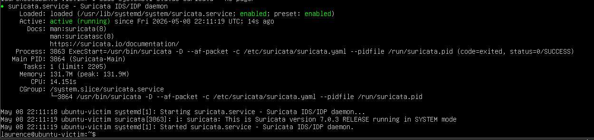
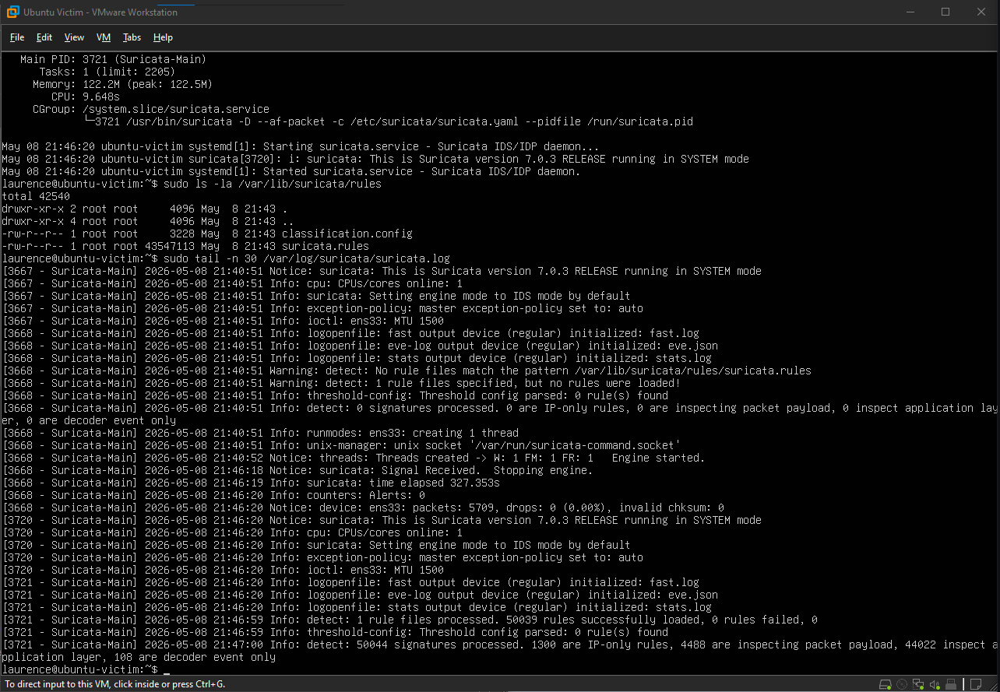
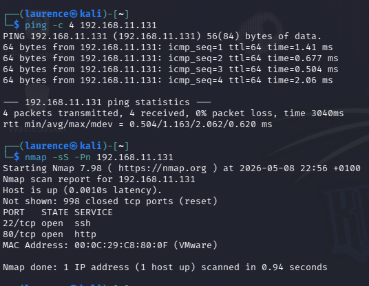
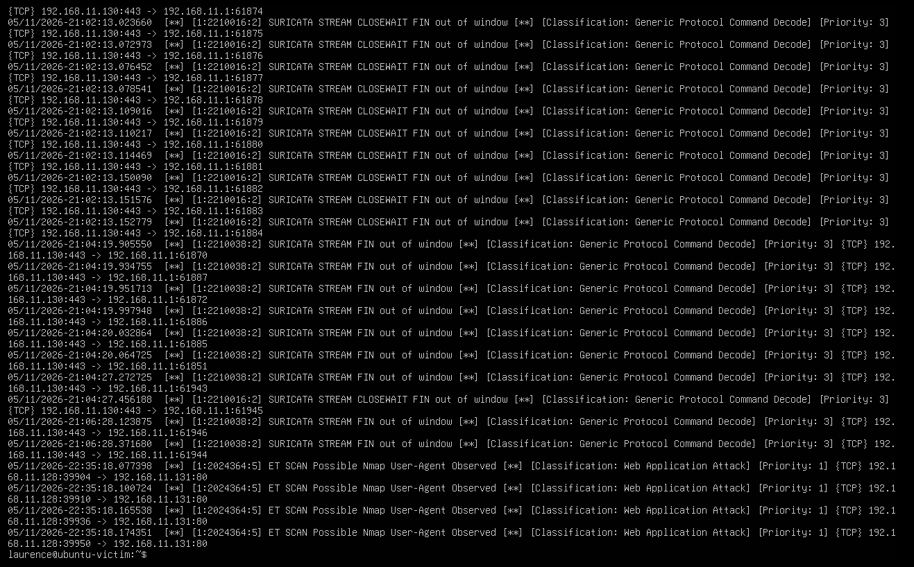
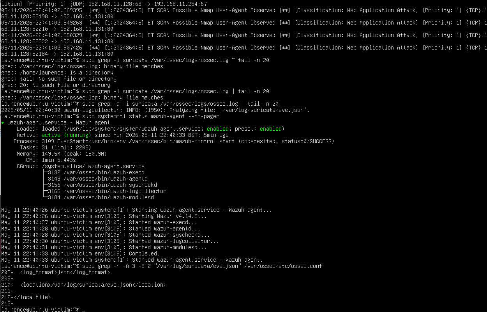
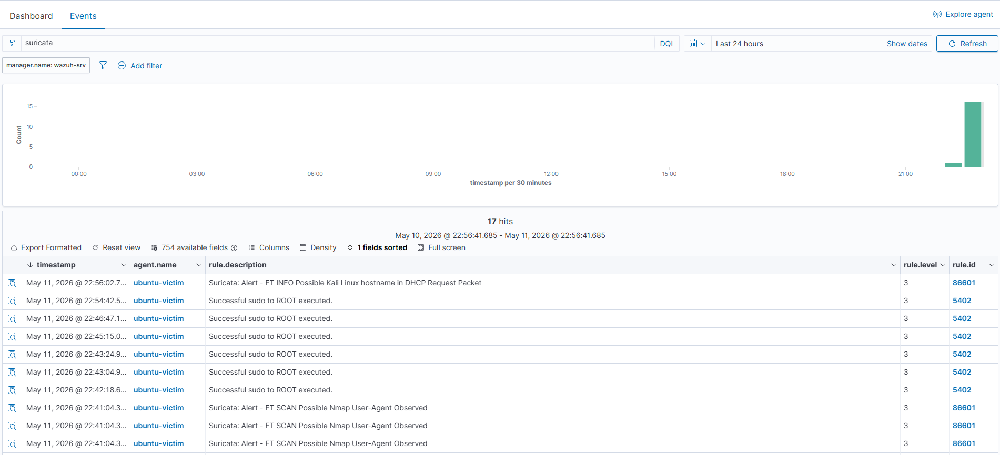
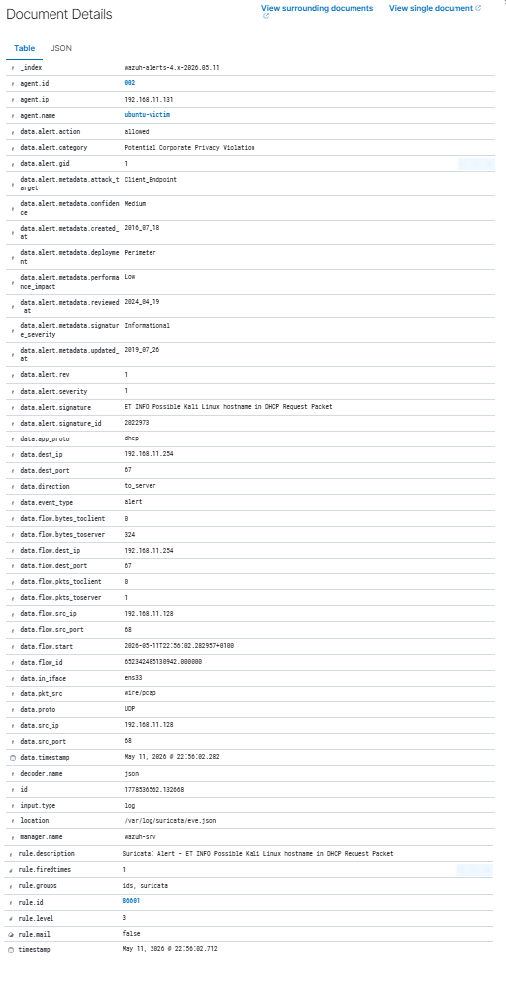

# Lab 10 - Wazuh Suricata Network Detection Integration

## Overview

This lab documents a network detection scenario where Suricata was configured on an Ubuntu victim machine and integrated with Wazuh for centralised alert collection and SOC-style investigation.

The goal was to prove the full detection chain:

```text
Kali attack traffic
Ubuntu victim network service
Suricata IDS alert
Suricata eve.json log
Wazuh agent collection
Wazuh dashboard security event
```

## Lab Objective

The objective was to generate controlled network traffic from Kali Linux, detect that traffic with Suricata on the Ubuntu victim, and confirm that Wazuh successfully ingested and displayed the Suricata alert.

This demonstrates how a host-based Wazuh agent can be extended with IDS telemetry from Suricata to improve network visibility.

## Environment

| Component | Purpose |
|---|---|
| Kali Linux | Attack and traffic generation machine |
| Ubuntu Victim | Target host running Apache2, Suricata, and Wazuh agent |
| Wazuh Server | SIEM manager, indexer, and dashboard |
| VMware Workstation | Virtual lab environment |
| Apache2 | Web service used to generate HTTP traffic |
| Suricata | Network IDS engine |
| Wazuh Agent | Log collection and forwarding |

## Network Details

| Host | IP Address | Role |
|---|---:|---|
| Wazuh Server | 192.168.11.130 | SIEM server |
| Ubuntu Victim | 192.168.11.131 | Suricata and Wazuh agent host |
| Kali Linux | 192.168.11.128 | Traffic source |

## Tools Used

- Wazuh
- Wazuh Dashboard
- Wazuh Agent
- Suricata
- Kali Linux
- Nmap
- curl
- Apache2
- Ubuntu Linux
- VMware Workstation

## Methodology

### 1. Confirmed Suricata service status

Suricata was checked on the Ubuntu victim to confirm that the IDS service was installed, enabled, and actively running.

Evidence:



### 2. Validated Suricata rules and configuration

The Suricata configuration was tested to confirm that the ruleset loaded correctly and that the configuration was valid.

Evidence:



### 3. Generated network traffic from Kali

Kali Linux was used to confirm connectivity to the Ubuntu victim and then generate network scanning traffic using Nmap.

Evidence:



### 4. Confirmed local Suricata alerting

Suricata generated alerts locally on the Ubuntu victim. The key alert observed was:

```text
ET SCAN Possible Nmap User-Agent Observed
```

This confirmed that Suricata detected the test traffic before Wazuh ingestion was reviewed.

Evidence:



### 5. Configured Wazuh agent to collect Suricata logs

The Ubuntu victim Wazuh agent was configured to read Suricata's JSON event log:

```xml
<localfile>
  <log_format>json</log_format>
  <location>/var/log/suricata/eve.json</location>
</localfile>
```

After restarting the Wazuh agent, the agent log confirmed that it was analysing the Suricata event file:

```text
INFO: Analyzing file: '/var/log/suricata/eve.json'
```

Evidence:



### 6. Confirmed Suricata alerts in Wazuh Dashboard

The Wazuh Dashboard showed Suricata alerts from the Ubuntu victim agent. The main detection observed was:

```text
Suricata: Alert - ET SCAN Possible Nmap User-Agent Observed
```

Evidence:



### 7. Reviewed Suricata event details in Wazuh

The event details confirmed that the alert came from Suricata and was collected from:

```text
/var/log/suricata/eve.json
```

The event also showed the agent name `ubuntu-victim`, confirming that the alert was associated with the correct monitored endpoint.

Evidence:



## Key Detection Evidence

| Evidence | Result |
|---|---|
| Suricata service running | Confirmed |
| Suricata rules loaded | Confirmed |
| Kali generated traffic | Confirmed |
| Suricata detected Nmap-style traffic | Confirmed |
| Wazuh agent collected eve.json | Confirmed |
| Wazuh Dashboard displayed Suricata alert | Confirmed |

## Findings

- Suricata was successfully deployed as a network IDS on the Ubuntu victim.
- Nmap and Nmap-style HTTP User-Agent traffic generated from Kali was detected by Suricata.
- Wazuh did not collect Suricata logs until `/var/log/suricata/eve.json` was added to the Wazuh agent configuration.
- After configuration and restart, Wazuh began analysing the Suricata JSON event log.
- Suricata alerts were visible in Wazuh Dashboard under the Ubuntu victim agent.

## Skills Demonstrated

- Network IDS deployment
- Suricata rule and service validation
- Nmap traffic generation
- Linux log analysis
- Wazuh agent configuration
- JSON log ingestion
- SIEM event validation
- SOC-style investigation workflow
- Evidence collection and lab documentation

## Conclusion

This lab successfully demonstrated Suricata integration with Wazuh. The completed workflow proved that network traffic generated from Kali could be detected by Suricata on the Ubuntu victim and then forwarded into Wazuh for centralised alerting and investigation.

This is a strong blue-team lab because it connects endpoint monitoring, IDS telemetry, log forwarding, and dashboard-based investigation into one repeatable detection workflow.
