# Lab 11 - Active Directory Security Monitoring and Wazuh Detection Engineering

## Overview

This lab documents the design, deployment, hardening, and monitoring of a small Windows Active Directory environment integrated with Wazuh and Sysmon.

The goal was to build a realistic internal domain, apply identity and access controls, enable detailed Windows auditing, centralise endpoint telemetry in Wazuh, and validate several attack and detection scenarios.

The completed workflow covered:

```text
Isolated VMware network
Windows Server domain controller
Domain-joined workstation and admin workstation
Users, groups, service accounts, SMB shares, and Group Policy
Advanced Windows auditing and Sysmon telemetry
Wazuh agent collection and alerting
Kali-generated test activity
Custom Wazuh detection rules
```

---

## Lab Objective

The objective was to create a monitored Active Directory lab that could support both defensive administration and controlled security testing.

The lab was designed to demonstrate the full security-monitoring chain:

1. Build and validate the Windows domain environment.
2. Implement role-based access and administrative separation.
3. Introduce controlled security weaknesses for testing.
4. Enable Windows Security and Sysmon telemetry.
5. Forward endpoint events to Wazuh.
6. Generate suspicious activity from Windows and Kali systems.
7. Confirm built-in and custom Wazuh detections.

---

## Environment

| Component | Purpose | Lab Address |
|---|---|---:|
| DC01 | Windows Server domain controller, DNS, file shares, and audit source | `10.20.30.10` |
| WS01 | Domain-joined Windows workstation and detection target | `10.20.30.101` |
| ADM01 | Domain-joined administrative workstation | `10.20.30.102` |
| Wazuh Server | SIEM manager, indexer, and dashboard | `10.20.30.20` |
| Kali Linux | Controlled attack and validation system | VMnet2 lab network |
| VMware Workstation | Virtualisation and isolated network platform | VMnet2 / `10.20.30.0/24` |

### Domain Details

| Field | Value |
|---|---|
| Active Directory domain | `reflect.test` |
| NetBIOS name | `REFLECT` |
| Domain controller | `DC01.reflect.test` |
| Workstation | `WS01.reflect.test` |
| Administrative workstation | `ADM01.reflect.test` |

---

## Tools Used

- Windows Server and Active Directory Domain Services
- Active Directory Users and Computers
- Group Policy Management
- Windows PowerShell
- Windows Advanced Audit Policy
- Windows Security Event Log
- Sysmon
- Wazuh Manager 4.14.5
- Wazuh agents
- Wazuh Dashboard
- Kali Linux
- VMware Workstation
- SMB file sharing

---

## Methodology and Evidence

## Phase 1 - Network and Domain Deployment

### 1. Configured a static address on DC01

DC01 was assigned the static address `10.20.30.10/24`. A fixed address was required because the server would provide domain and DNS services to the other Windows systems.

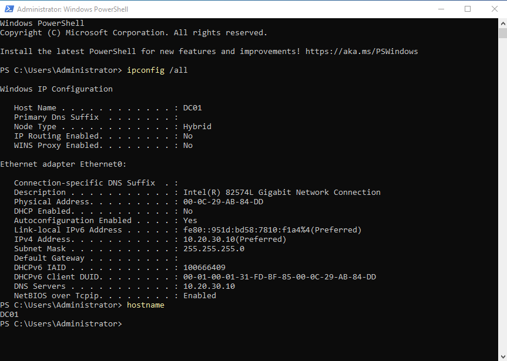

### 2. Validated bidirectional connectivity between WS01 and DC01

Connectivity was tested in both directions to confirm that the workstation and domain controller could communicate across the isolated lab network.

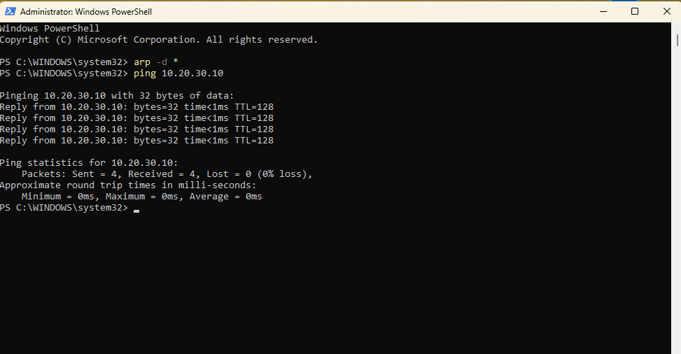

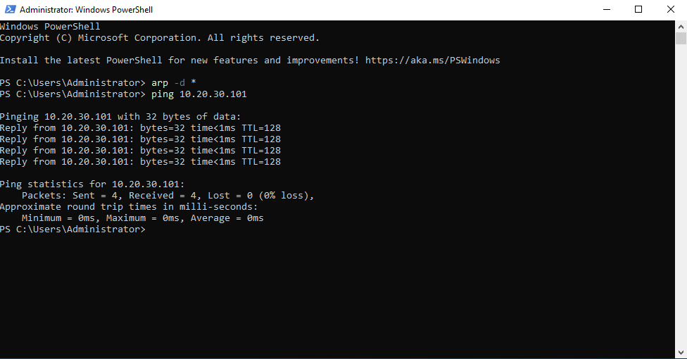

### 3. Configured ADM01 and validated domain-controller connectivity

ADM01 was assigned `10.20.30.102` and tested against DC01. Reverse connectivity from DC01 to ADM01 was also confirmed.

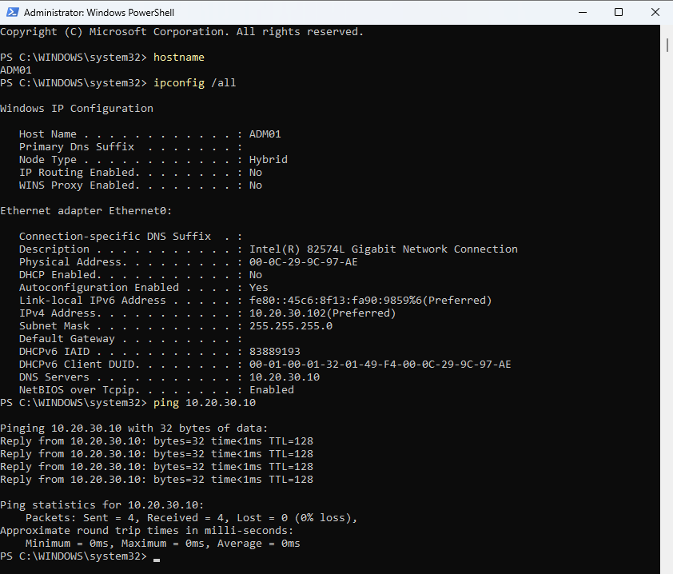

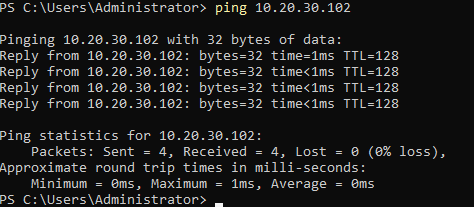

### 4. Installed Active Directory Domain Services

The AD DS server role and its management tools were installed successfully on DC01.

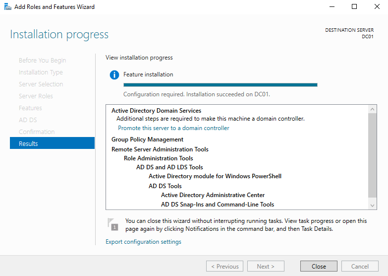

### 5. Created and verified the `reflect.test` domain

DC01 was promoted to a domain controller for the new `reflect.test` forest. PowerShell checks confirmed the domain, NetBIOS name, domain controller address, DNS resolution, and current user domain.

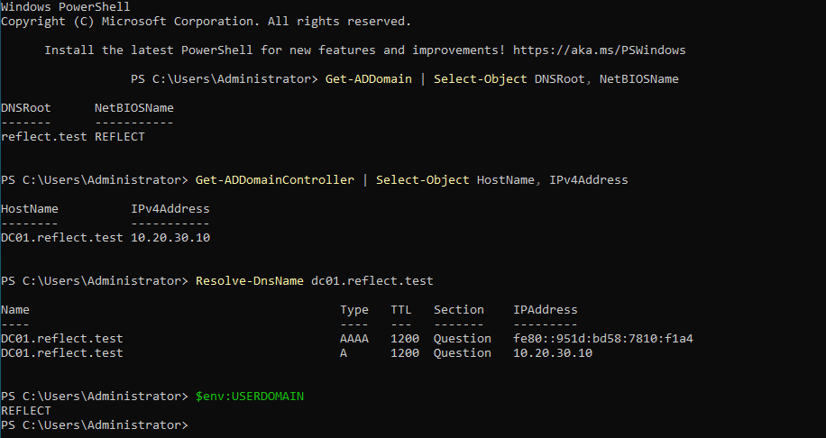

### 6. Joined WS01 and ADM01 to the domain

Both Windows endpoints were joined to `reflect.test`. The system information confirmed that each computer was a domain member.

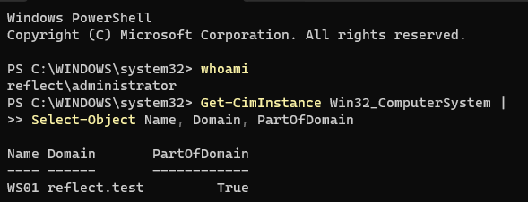

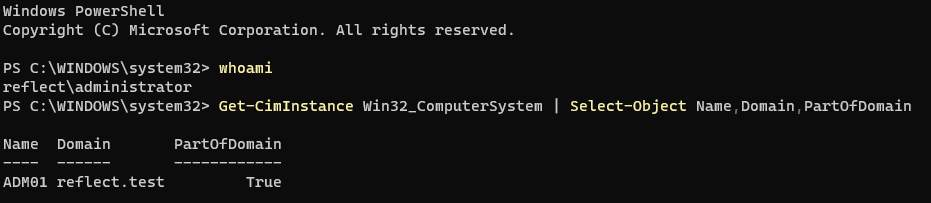

---

## Phase 2 - Identity, Access, and File-Share Configuration

### 7. Built the Active Directory organisational-unit structure

Organisational units were created to separate computers, users, privileged accounts, service accounts, and departmental identities. This structure supported cleaner administration and targeted Group Policy application.

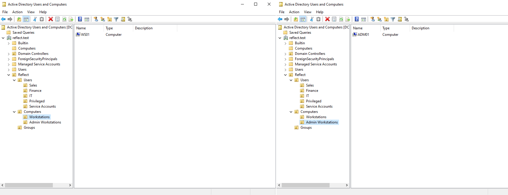

### 8. Assigned James Hall to the Sales security group

The user account for James Hall was added to the Sales group, demonstrating role-based access through group membership rather than direct per-user permissions.

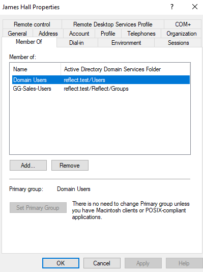

### 9. Verified departmental security-group memberships

PowerShell was used to enumerate the Sales, Finance, and IT group memberships and confirm that departmental accounts had been assigned correctly.

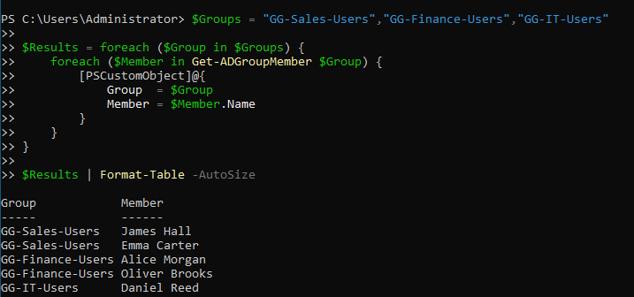

### 10. Created privileged and service accounts

Separate administrative and backup service accounts were created in dedicated organisational units. This demonstrated account separation and provided identities for later monitoring scenarios.

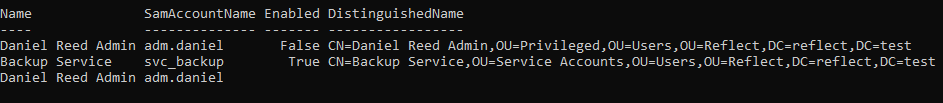

### 11. Created departmental SMB shares

Departmental file shares were created on DC01 and their access-control configuration was reviewed.

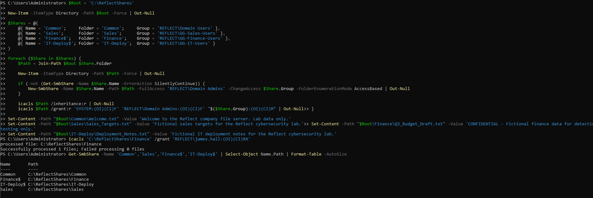

### 12. Introduced a controlled Finance-share misconfiguration

James Hall was deliberately granted read access to the Finance share. This intentional weakness created a realistic access-control test case for later auditing and detection.

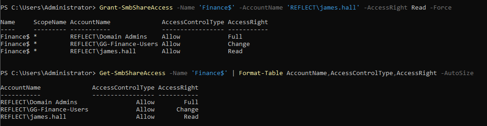

### 13. Tested unauthorised Finance access

James Hall could read the test Finance document but was denied permission when attempting to modify it. This confirmed the controlled exposure and produced activity suitable for Windows auditing.

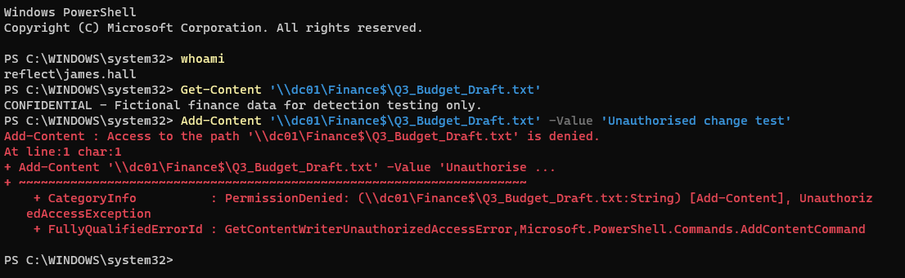

---

## Phase 3 - Group Policy and Windows Auditing

### 14. Linked the workstation local-administrator policy

A Group Policy Object was linked to the workstation organisational units so the designated domain group could be applied consistently to the local Administrators group.

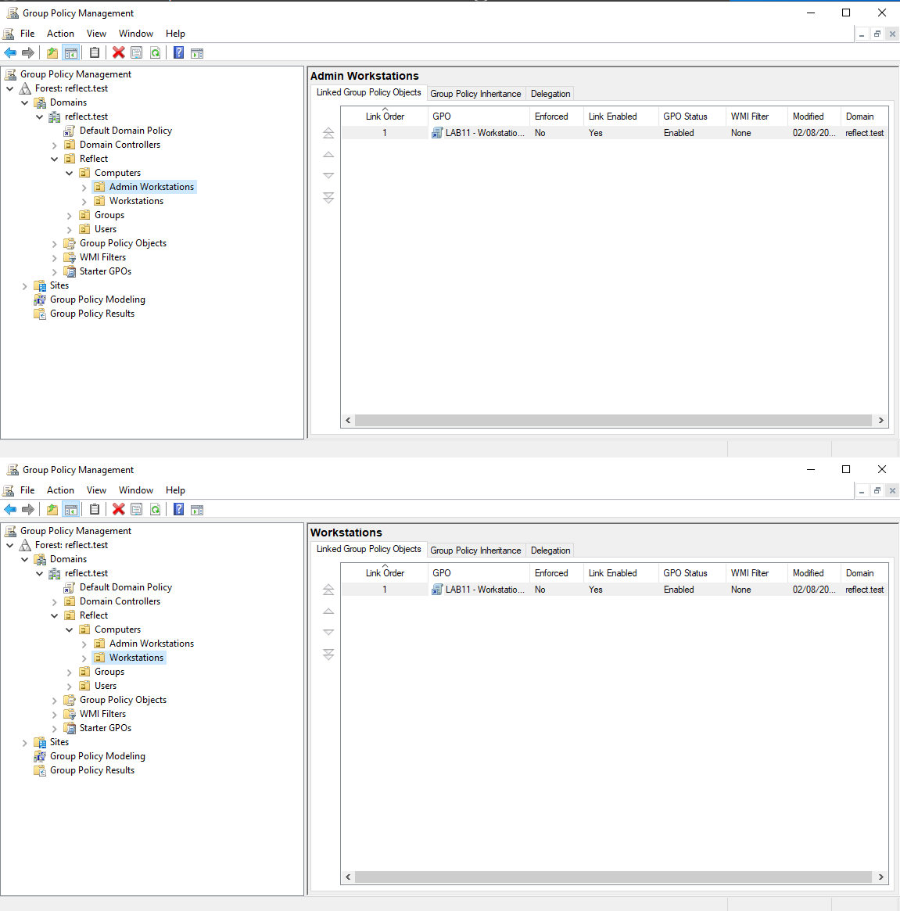

### 15. Verified the policy on WS01 and ADM01

Local group membership and Group Policy results confirmed that `REFLECT\GG-Workstation-Admins` was present and that the policy applied successfully to both endpoints.

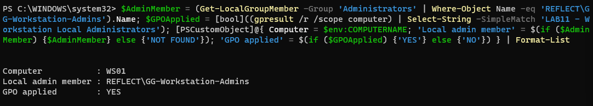

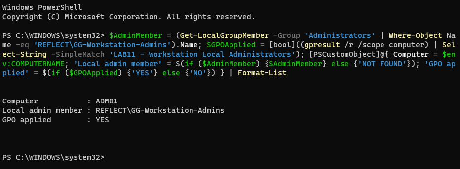

### 16. Created the enhanced Windows logging policy

The `LAB11 - Enhanced Windows Logging` GPO enabled script-block logging, module logging, and process command-line capture to improve investigation visibility.

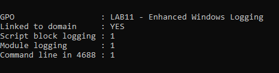

### 17. Enabled advanced audit policy on DC01

Advanced audit categories were enabled for logon, special logon, file-share access, process creation, account management, security-group management, directory-service changes, policy changes, and credential validation.

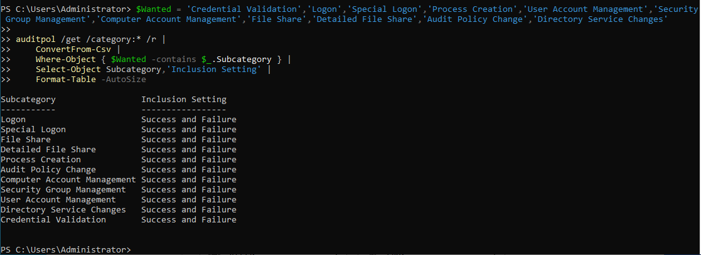

### 18. Enabled auditing on the Finance folder

The Finance share received a file-system audit rule for the James Hall account, recording successful and failed access attempts.

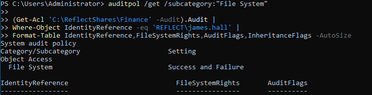

### 19. Confirmed Finance-access Security events

Windows Security events showed activity against `Q3_Budget_Draft.txt`, including Event IDs `4663` and `5145`. This proved that object and network-share access were being captured.

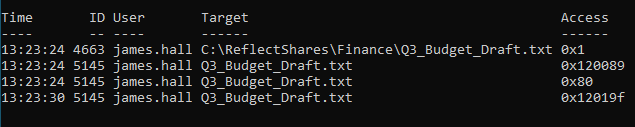

---

## Phase 4 - Wazuh and Sysmon Integration

### 20. Connected the Wazuh server to the isolated lab network

The Wazuh server was configured on VMnet2 and successfully reached DC01 at `10.20.30.10`.

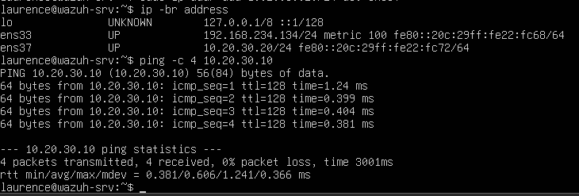

### 21. Confirmed the Wazuh network configuration persisted

After rebooting, the Wazuh server retained its `10.20.30.20/24` address and could still reach DC01.

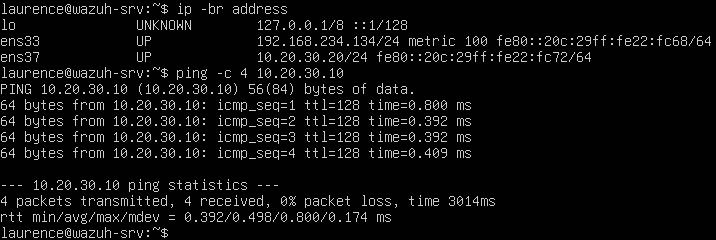

### 22. Verified Wazuh services, ports, and version

The Wazuh manager, indexer, dashboard, and supporting ports were checked. The manager reported version `4.14.5`.

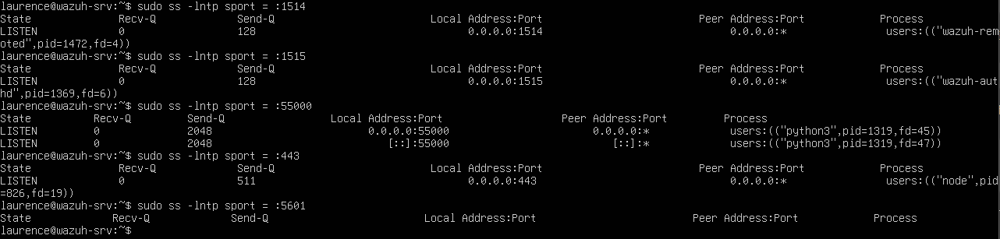

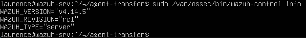

### 23. Registered DC01 with Wazuh

The Wazuh agent list confirmed that DC01 was active and communicating with the manager.

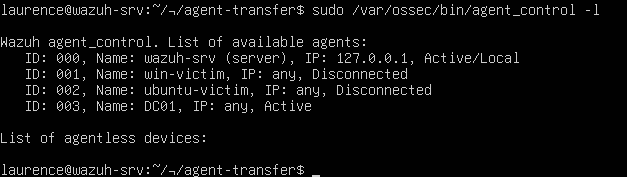

### 24. Configured DC01 Security-log collection

The DC01 Wazuh agent was configured to collect the Windows Security channel. Service status and network checks confirmed that the agent was running and could reach the manager.

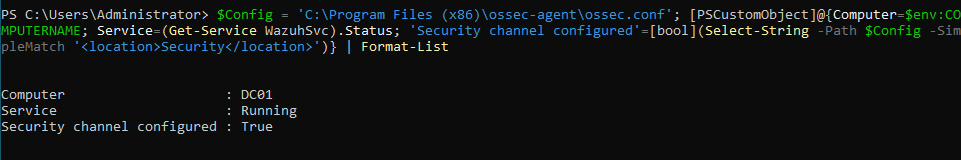

### 25. Confirmed failed-logon detection from DC01

A controlled failed sign-in generated a Wazuh alert from DC01. The dashboard event proved that Windows authentication telemetry was reaching the SIEM.

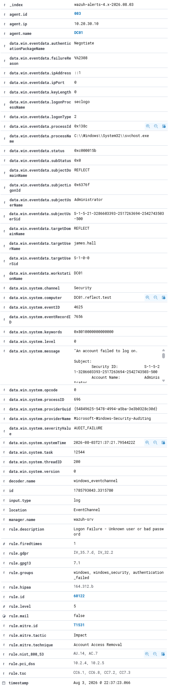

### 26. Registered WS01 and ADM01 with Wazuh

The Wazuh manager showed both domain endpoints as active agents alongside DC01.

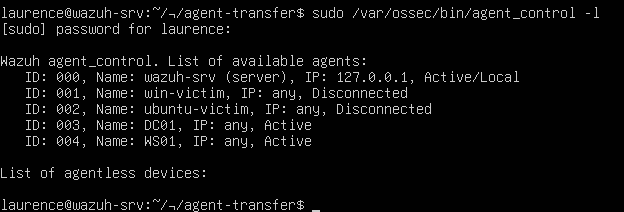

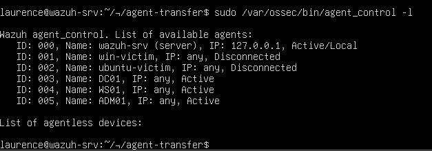

### 27. Installed and verified Sysmon on DC01

Sysmon was installed and running on the domain controller. A recent event confirmed that endpoint process telemetry was being produced.

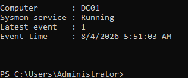

### 28. Configured DC01 Sysmon collection in Wazuh

The DC01 agent was configured to collect the `Microsoft-Windows-Sysmon/Operational` channel and could reach the Wazuh manager on port `1514`.

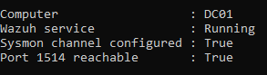

### 29. Confirmed DC01 Sysmon process events in Wazuh

Wazuh displayed detailed Sysmon process-creation telemetry from DC01, proving the endpoint-to-SIEM data path.

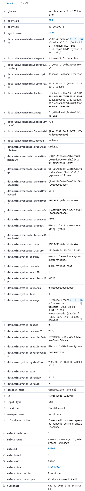

### 30. Installed and verified Sysmon on WS01

The Sysmon service and recent operational events were confirmed on the workstation.

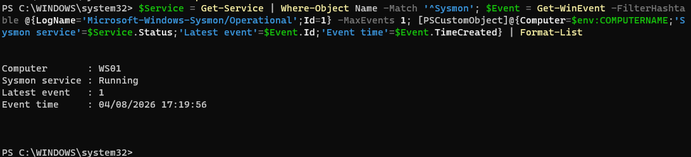

### 31. Configured WS01 Sysmon collection in Wazuh

The WS01 agent was running, the Sysmon channel was configured, and the Wazuh manager was reachable on port `1514`.

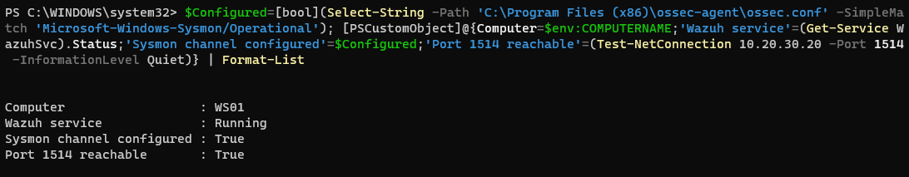

### 32. Confirmed Sysmon activity from WS01 and ADM01

The Wazuh Dashboard showed process and discovery events associated with both agents, confirming multi-endpoint visibility.

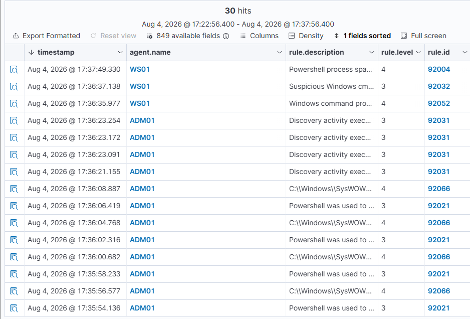

---

## Phase 5 - Attack Simulation and Detection Validation

### 33. Validated Kali connectivity

Kali Linux successfully reached both DC01 and the Wazuh server across the isolated lab network.

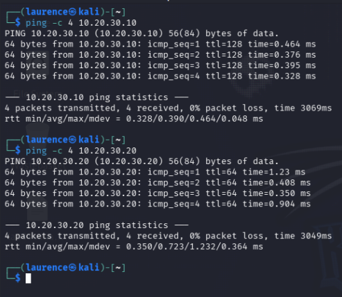

### 34. Detected an SMB failed-logon attempt from Kali

A controlled SMB authentication failure generated Windows security telemetry that was ingested and displayed in Wazuh.

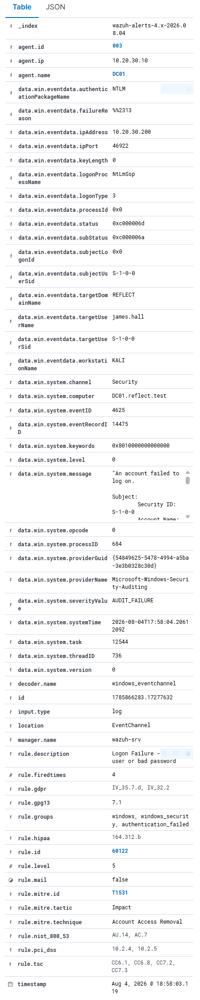

### 35. Validated a custom Finance-share access detection

A custom Wazuh rule detected access to the monitored Finance share. This converted raw Windows share-access telemetry into a higher-value, scenario-specific alert.

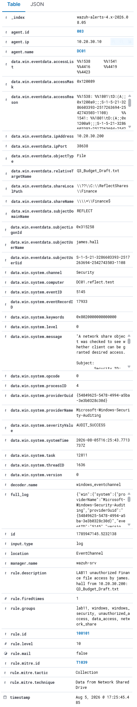

### 36. Detected encoded PowerShell on WS01

A controlled encoded PowerShell command was executed on WS01. Wazuh detected the suspicious command-line behaviour using the enhanced Windows and Sysmon telemetry.

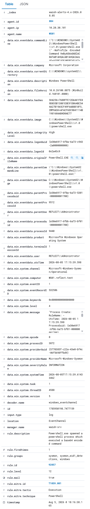

### 37. Detected scheduled-task persistence

A custom detection identified scheduled-task creation used to simulate persistence. This demonstrated monitoring for a common Windows persistence technique.

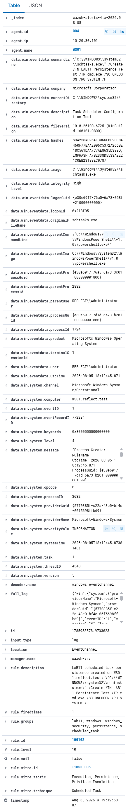

### 38. Detected a privileged-group membership change

Wazuh detected a change to privileged group membership and exposed the affected user and group information for investigation.

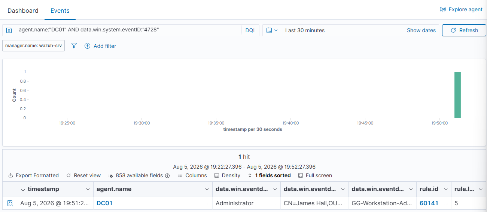

### 39. Investigated Event ID 5145 in Wazuh

The Wazuh event view showed detailed network-share access telemetry for Event ID `5145`, including the account, share, object, access mask, and originating endpoint information.

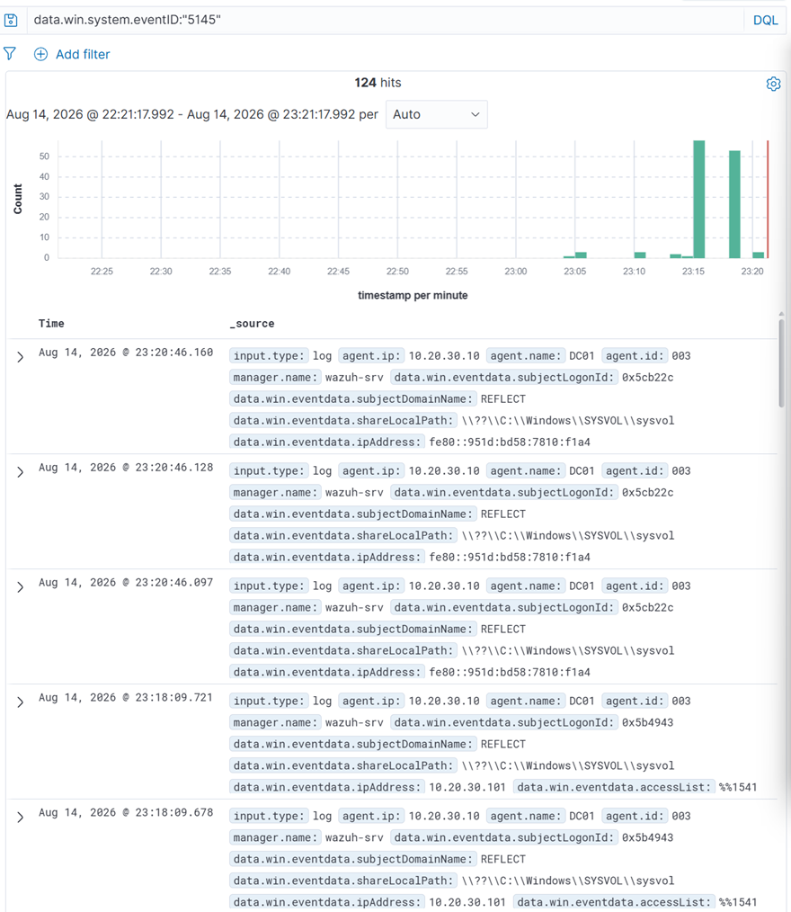

---

## Key Detection Evidence

| Detection or Control | Result |
|---|---|
| Domain and DNS validation | Confirmed |
| WS01 and ADM01 domain membership | Confirmed |
| Departmental group membership | Confirmed |
| Workstation local-admin GPO | Applied to WS01 and ADM01 |
| Advanced Windows auditing | Enabled |
| Finance folder access auditing | Enabled and generating events |
| DC01, WS01, and ADM01 Wazuh agents | Active |
| Windows Security channel ingestion | Confirmed |
| Sysmon ingestion from Windows endpoints | Confirmed |
| Failed Windows and SMB authentication | Detected |
| Finance-share access | Detected with custom rule |
| Encoded PowerShell execution | Detected |
| Scheduled-task persistence | Detected with custom rule |
| Privileged-group membership change | Detected |
| Event ID 5145 share access | Investigated in Wazuh |

---

## Security Findings

### Finding 1 - Finance-share access was broader than intended

James Hall, a Sales user, was deliberately granted read access to the Finance share. The test confirmed that he could read a Finance document even though modification was denied.

This demonstrated why access reviews must evaluate all effective permissions. Blocking write access does not remove the confidentiality risk created by unauthorised read access.

### Finding 2 - Native Windows auditing provided essential context

Advanced audit policy and folder-level auditing generated the Windows events needed to identify who accessed the Finance share, which object was targeted, and which access rights were requested.

### Finding 3 - Sysmon materially improved endpoint visibility

Windows Security logs recorded authentication, account, policy, and share activity. Sysmon added detailed process telemetry that supported PowerShell and persistence detections.

### Finding 4 - Centralised monitoring made multi-host investigation practical

With DC01, WS01, and ADM01 connected to Wazuh, activity from several systems could be reviewed through a single dashboard rather than investigated separately on each endpoint.

### Finding 5 - Custom rules increased the value of raw events

Native Event IDs provided the underlying evidence, while custom Wazuh rules elevated lab-specific behaviours such as Finance-share access and scheduled-task persistence into clearer security alerts.

---

## Recommended Hardening Actions

1. Remove the intentional James Hall access-control entry from the Finance share.
2. Review both SMB share permissions and NTFS permissions for departmental data.
3. Perform regular reviews of privileged and departmental group membership.
4. Use separate administrative accounts only from managed administrative workstations.
5. Apply least privilege to service accounts and deny interactive sign-in where appropriate.
6. Retain advanced audit policy, PowerShell logging, command-line logging, and Sysmon coverage.
7. Monitor Event IDs associated with failed logons, share access, group changes, process creation, and scheduled tasks.
8. Tune custom Wazuh rules to reduce false positives while preserving high-value context.
9. Protect the Wazuh manager and dashboard using restricted administration and secure network access.
10. Document and test an incident-response workflow for each high-priority detection.

---

## Analyst Notes

The strongest part of this lab was the connection between system administration and detection engineering.

The Active Directory environment created realistic identities, groups, systems, policies, and data-access paths. Windows auditing and Sysmon then exposed the activity generated inside that environment. Wazuh centralised the telemetry, while controlled tests from Windows and Kali validated that meaningful security behaviours could be detected.

This is an important SOC workflow: do not stop at proving that a log exists. Confirm the source host, user, target object, action, rule, and surrounding context, then connect the event to the security control or threat behaviour being tested.

---

## Skills Demonstrated

- Active Directory Domain Services deployment
- Windows domain and DNS validation
- Domain workstation administration
- Organisational-unit design
- User, group, privileged-account, and service-account management
- Role-based access control
- SMB share and NTFS permission testing
- Group Policy creation and validation
- Windows Advanced Audit Policy
- PowerShell and process command-line logging
- Windows Security event analysis
- Wazuh manager and Windows agent deployment
- Sysmon installation and SIEM integration
- Multi-endpoint security monitoring
- Kali-based authentication testing
- Custom Wazuh rule validation
- Encoded PowerShell detection
- Scheduled-task persistence detection
- Privileged-group change monitoring
- Network-share access investigation
- Evidence collection and SOC-style documentation

---

## Conclusion

This lab successfully built and monitored a complete Active Directory security environment.

DC01, WS01, and ADM01 were configured on an isolated network and joined to the `reflect.test` domain. Organisational units, users, groups, privileged accounts, service accounts, SMB shares, and Group Policy controls were implemented and validated. Advanced Windows auditing and Sysmon provided detailed endpoint telemetry, while Wazuh centralised events from all three Windows systems.

Controlled testing confirmed detection of failed authentication, SMB activity, Finance-share access, encoded PowerShell, scheduled-task persistence, privileged-group changes, and Event ID `5145` network-share access.

The completed project demonstrates practical Active Directory administration, Windows security logging, endpoint telemetry, SIEM integration, attack simulation, detection engineering, and evidence-led investigation in one repeatable lab.
