# Lab 12 - Operation Blackout: Segmented Active Directory Detection Lab

## Overview

Operation Blackout redesigned the existing Active Directory monitoring lab into a segmented enterprise-style environment. The project placed corporate endpoints, security infrastructure, and the attack host on separate networks controlled by pfSense, then validated that Wazuh and Sysmon retained useful visibility across those boundaries.

The finished lab combined network segmentation, Active Directory administration, Group Policy, endpoint telemetry, SIEM health recovery, controlled adversary simulation, and evidence-led alert investigation.

---

## Executive Summary

Three Windows systems in the `reflect.test` domain were monitored by a Wazuh all-in-one server on a dedicated security network. Kali Linux was isolated on a separate attack network. pfSense denied attack-network access to the corporate and security segments by default, while a narrowly scoped temporary rule permitted one controlled SMB authentication test against WS01.

The test generated attributable Windows authentication events on both WS01 and DC01. Wazuh recorded the target username, Kali source address, workstation name, rule severity, and MITRE mapping. A second test used a harmless encoded PowerShell command and produced Sysmon process-creation alerts on WS01. After validation, the temporary pfSense and Windows Firewall exceptions were removed and TCP/445 returned to a filtered state.

### Portfolio Highlights

| Measure | Result |
|---|---|
| Segmented networks | Corporate, Security, Attack, and NAT/WAN |
| Domain-joined Windows systems | 3 |
| Active Wazuh agents | 3 |
| Endpoint telemetry | Windows Security and Sysmon |
| Controlled detection scenarios | SMB failed logon and encoded PowerShell |
| Evidence screenshots | 10 |
| Final attack-to-corporate SMB state | Filtered |

---

## Architecture

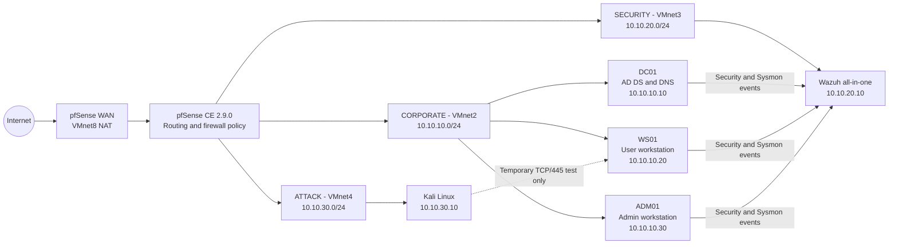

### Network Plan

| Zone | VMware network | Subnet | pfSense gateway | Systems |
|---|---|---|---|---|
| WAN | VMnet8 NAT | VMware-managed | WAN interface | Internet access |
| Corporate | VMnet2 | `10.10.10.0/24` | `10.10.10.1` | DC01, WS01, ADM01 |
| Security | VMnet3 | `10.10.20.0/24` | `10.10.20.1` | Wazuh server |
| Attack | VMnet4 | `10.10.30.0/24` | `10.10.30.1` | Kali Linux |

VMware DHCP and host adapters were disabled on the three internal networks. Addressing, routing, and security policy therefore remained explicit and repeatable.

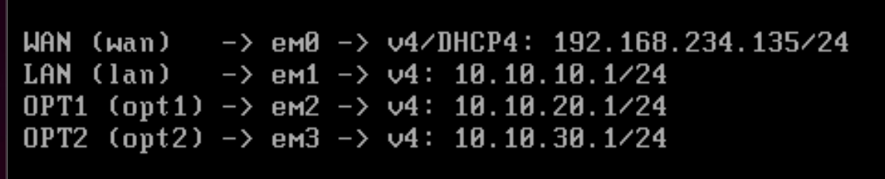

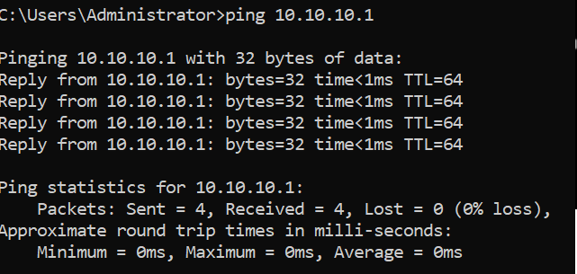

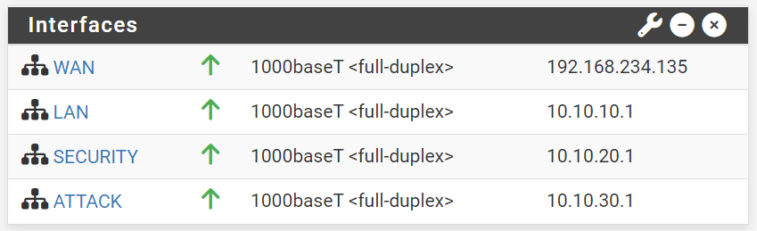

---

## Objectives

1. Separate business systems, monitoring infrastructure, and the attack host into distinct security zones.
2. Preserve Active Directory, DNS, Group Policy, and Wazuh communication across the new addressing plan.
3. Apply default-deny rules from the attack network to the corporate and security networks.
4. Confirm Windows Security and Sysmon collection from DC01, WS01, and ADM01.
5. Generate controlled activity and validate that alerts retain sufficient attribution for investigation.
6. Remove all temporary test access and confirm the final isolated state.

---

## Phase 1 - Network Segmentation and Firewall Policy

pfSense was configured with four interfaces: WAN, Corporate, Security, and Attack. The Corporate, Security, and Attack networks were assigned independent `/24` address spaces and pfSense acted as the gateway between them.

The Attack interface used ordered rules to:

- block access to pfSense itself;
- block Attack-to-Corporate traffic;
- block Attack-to-Security traffic; and
- permit Internet access where required for the lab.

For the SMB validation only, a temporary higher-priority rule allowed `10.10.30.10` to reach `10.10.10.20` on TCP port `445`. This was a host-to-host, single-port exception rather than broad access between zones.

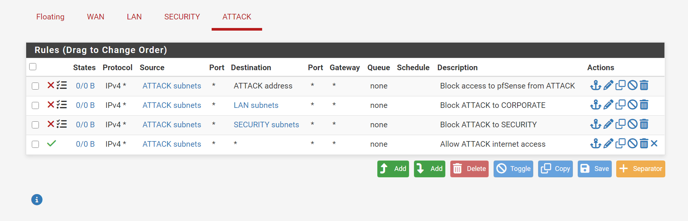

Before the exception, Nmap reported TCP/445 as `filtered`. During the test it reported the port as `open`. After both temporary rules were removed, the final scan again reported `filtered`, confirming restored isolation.

---

## Phase 2 - Active Directory and Endpoint Controls

The `reflect.test` domain retained a role-based structure with separate organisational units for users, workstations, administrative workstations, privileged accounts, and service accounts.

### Core Systems

| Host | Role | Address | DNS |
|---|---|---|---|
| DC01 | Windows Server 2022 domain controller and DNS | `10.10.10.10` | `10.10.10.10` |
| WS01 | Windows 11 user workstation | `10.10.10.20` | `10.10.10.10` |
| ADM01 | Windows 11 administrative workstation | `10.10.10.30` | `10.10.10.10` |
| wazuh-srv | Wazuh manager, indexer, dashboard, and Filebeat | `10.10.20.10` | Lab DNS/routing configuration |
| Kali | Controlled attack host | `10.10.30.10` | Lab DNS/routing configuration |

### Identity and Policy Design

- Department groups included `GG-Sales-Users`, `GG-Finance-Users`, and `GG-IT-Users`.
- `GG-Workstation-Admins` provided delegated workstation administration.
- The privileged account `adm.daniel` was used from ADM01.
- `LAB12 - Workstation Local Administrators` applied the administrative group to managed workstations.
- `LAB12 - Enhanced Windows Logging` enabled the endpoint audit settings required for detection.

`gpresult` confirmed both LAB12 policies on ADM01 and WS01. ADM01's local Administrators membership also confirmed `REFLECT\GG-Workstation-Admins`. `Test-ComputerSecureChannel` returned `True`, and `dcdiag /q` returned no output, providing a clean domain-health baseline.

---

## Phase 3 - Wazuh and Sysmon Validation

The readdressed Windows agents were updated to use the Wazuh manager at `10.10.20.10`. Connectivity to TCP/1514 succeeded and each Wazuh agent service was running.

The final dashboard inventory contained exactly the three required active agents:

| Agent ID | Agent | Address | Status |
|---:|---|---|---|
| 003 | DC01 | `10.10.10.10` | Active |
| 004 | WS01 | `10.10.10.20` | Active |
| 005 | ADM01 | `10.10.10.30` | Active |

Legacy agents from earlier builds were removed so the inventory reflected the current environment only.

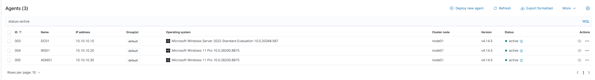

Sysmon's Operational channel was enabled on all three Windows systems and configured in each Wazuh agent as an `eventchannel` source. The dashboard then displayed current process, file, discovery, and network activity from the endpoints.

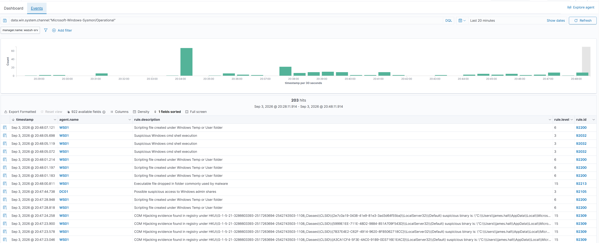

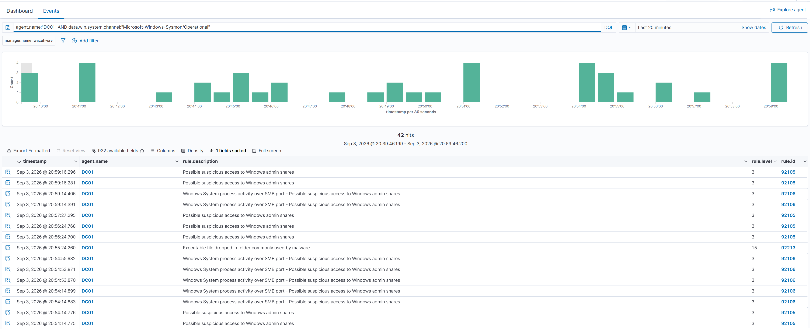

### Wazuh Service Recovery

During validation, the Wazuh indexer exceeded its systemd startup timeout even though its Java process continued initialising. Investigation found a malformed drop-in file whose timeout assignments lacked a `[Service]` section and were therefore ignored.

The invalid file was preserved with an `.invalid-backup` suffix and replaced by a valid override:

```ini
[Service]
TimeoutStartSec=600
TimeoutStopSec=300
```

After reloading systemd, the indexer completed startup. The indexer, manager, Filebeat, and dashboard all returned `active`, and an HTTPS request to local indexer port `9200` returned `401 Unauthorized`. That response was expected without credentials and proved that the secured API was listening.

---

## Phase 4 - Controlled SMB Authentication Test

The test was deliberately narrow and reversible:

1. Confirm TCP/445 from Kali to WS01 was initially filtered.
2. Add the temporary pfSense host-and-port exception.
3. Add a temporary WS01 inbound firewall rule allowing TCP/445 only from `10.10.30.10`.
4. Confirm TCP/445 was open.
5. Attempt one authentication using the synthetic username `LAB12-Test` and an intentionally incorrect password.
6. Investigate the resulting Wazuh events.
7. Remove both temporary exceptions and confirm TCP/445 was filtered again.

The Kali command returned `NT_STATUS_LOGON_FAILURE`, as expected. The following Wazuh query correlated endpoint and domain authentication telemetry:

```text
(agent.name:"WS01" OR agent.name:"DC01") AND
(data.win.system.eventID:4625 OR data.win.system.eventID:4776)
```

Two alerts were returned: a WS01 logon failure and a DC01 Windows audit failure.

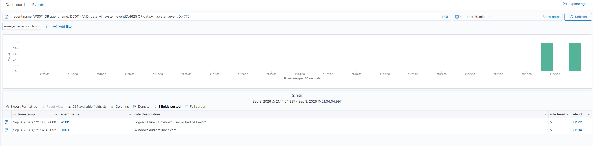

The detailed WS01 event retained the fields required to attribute the activity:

| Field | Evidence |
|---|---|
| Agent | `WS01` |
| Windows Event ID | `4625` |
| Rule | `60122` - Logon Failure: Unknown user or bad password |
| Rule level | 5 |
| Target username | `LAB12-Test` |
| Source address | `10.10.30.10` |
| Workstation | `KALI` |
| MITRE mapping shown | `T1531` |

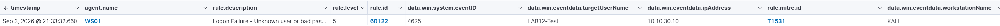

---

## Phase 5 - Encoded PowerShell Detection

A harmless PowerShell command was converted to Unicode Base64 and executed on WS01 with `-EncodedCommand`. The payload only printed a lab test message; its purpose was to exercise process-command-line monitoring without changing the system.

Wazuh returned two related Sysmon process-creation alerts. The compact evidence view showed:

| Field | Evidence |
|---|---|
| Agent | `WS01` |
| Sysmon Event ID | `1` - Process Create |
| User | `REFLECT\Administrator` |
| Process | `powershell.exe` |
| Command-line indicator | `-EncodedCommand` |
| MITRE mapping | `T1059.001` - PowerShell |

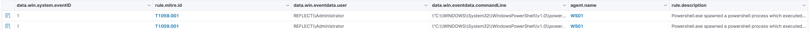

---

## Detection Results

| Scenario | Data source | Wazuh evidence | Outcome |
|---|---|---|---|
| SMB authentication failure | Windows Security | Event `4625` on WS01, corresponding audit failure on DC01 | Detected and attributed to Kali |
| Encoded PowerShell | Sysmon Operational | Event `1`, PowerShell command line, user and endpoint context | Detected on WS01 |
| Cross-endpoint telemetry | Sysmon Operational | Current DC01, WS01, and ADM01 events | Collection confirmed |
| Attack-zone isolation | pfSense and Nmap validation | TCP/445 filtered before and after the controlled exception | Final state confirmed |

### Benign High-Severity Event Review

During threat hunting, Wazuh rule `92213` produced a level-15 alert for a PowerShell-created `__PSScriptPolicyTest_*.ps1` file. The path and filename matched PowerShell's expected AppLocker policy-test behaviour. It was therefore documented as a benign false positive rather than misreported as malware. This highlights the need to validate alert context instead of relying on severity alone.

---

## MITRE ATT&CK Mapping

| Observed behaviour | Technique | Evidence |
|---|---|---|
| Encoded PowerShell execution | `T1059.001` - PowerShell | Sysmon Event ID `1` and Wazuh alert on WS01 |
| SMB authentication attempt using an invalid account/password | Credential-access and authentication telemetry; dashboard displayed `T1531` | Windows Event ID `4625`, source `10.10.30.10`, workstation `KALI` |
| PowerShell-created test file flagged by Wazuh | `T1105` - Ingress Tool Transfer, as mapped by the rule | Rule `92213`; investigated and classified as benign in this instance |

MITRE mappings shown here distinguish between the mapping supplied by the Wazuh rule and the analyst's conclusion about what the event actually represented.

---

## Security Findings

### 1. Segmentation reduced the attack surface

Kali could not reach SMB on WS01 until both network and host controls were deliberately narrowed. The final filtered scan proved the test path was closed again.

### 2. Layered controls behaved independently

The pfSense exception alone was insufficient if Windows Firewall did not also permit the connection. This demonstrated how perimeter and endpoint controls combine to protect a service.

### 3. Centralised telemetry preserved attribution

The SMB alert contained the affected endpoint, target username, attack-host IP address, workstation name, event ID, and rule context. These fields were sufficient to build a clear investigation timeline.

### 4. Sysmon improved behavioural visibility

Sysmon process-creation telemetry exposed the complete PowerShell execution context that a simple authentication or service log would not provide.

### 5. Monitoring-platform health is part of detection engineering

The indexer timeout prevented the dashboard from becoming ready. Identifying the malformed systemd override and validating all four Wazuh services restored the full ingestion and investigation pipeline.

---

## Hardening Recommendations

1. Keep Attack-to-Corporate and Attack-to-Security policies denied by default.
2. Use time-limited, host-specific, and port-specific exceptions for authorised testing.
3. Remove temporary host firewall rules immediately after validation.
4. Review pfSense state tables when changing rules so stale sessions do not affect retesting.
5. Retain enhanced Windows logging and Sysmon on domain endpoints.
6. Monitor repeated Event ID `4625` activity, unusual source networks, and unexpected workstation names.
7. Alert on encoded PowerShell while retaining parent-process, user, and command-line context for tuning.
8. Monitor Wazuh component health and preserve valid systemd drop-ins under version control or configuration management.
9. Review high-severity alerts for environmental false positives before escalating them.
10. Restrict administration to managed accounts and administrative workstations.

---

## Scope and Limitations

- All identities, hosts, credentials, and events were created in an isolated home lab.
- The SMB test used one intentionally failed authentication attempt, not password spraying or brute force.
- The temporary firewall exception permitted only one source, one destination, and one port.
- The PowerShell payload was benign and used only to validate logging and detection.
- Wazuh rule mappings were recorded as displayed; a displayed MITRE mapping does not by itself prove malicious intent.
- High availability, production retention, performance testing, and enterprise-scale rule tuning were outside scope.

---

## Skills Demonstrated

- VMware virtual network design
- pfSense interface and firewall administration
- Network segmentation and default-deny policy
- Active Directory, DNS, and secure-channel validation
- Organisational-unit and group-based administration
- Group Policy deployment and verification
- Windows Defender Firewall configuration
- Windows Security event analysis
- Sysmon deployment and event-channel collection
- Wazuh agent reconfiguration and inventory hygiene
- Wazuh manager, indexer, Filebeat, and dashboard troubleshooting
- systemd service override diagnosis
- Kali, Nmap, and SMB validation in an authorised lab
- Encoded PowerShell detection
- MITRE ATT&CK interpretation
- False-positive analysis
- Evidence collection and SOC reporting

---

## Conclusion

Operation Blackout successfully transformed the domain lab into a segmented, monitored environment with distinct corporate, security, and attack zones.

DC01, WS01, and ADM01 remained healthy domain members after readdressing, received the intended LAB12 Group Policies, and reported Windows Security and Sysmon telemetry to Wazuh across the pfSense boundary. The Wazuh stack was recovered from an indexer startup-timeout fault and returned to a fully active state.

Controlled SMB and encoded PowerShell tests proved that the monitoring pipeline could detect activity and preserve the details required for investigation. Finally, all temporary access was removed and Kali-to-WS01 SMB returned to a filtered state. The lab therefore demonstrates not only attack detection, but also segmentation, safe test design, platform troubleshooting, evidence validation, and secure restoration of the environment.

