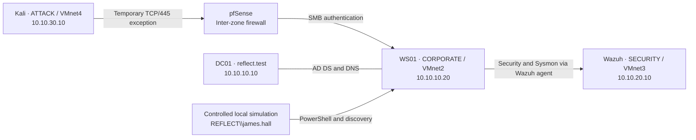
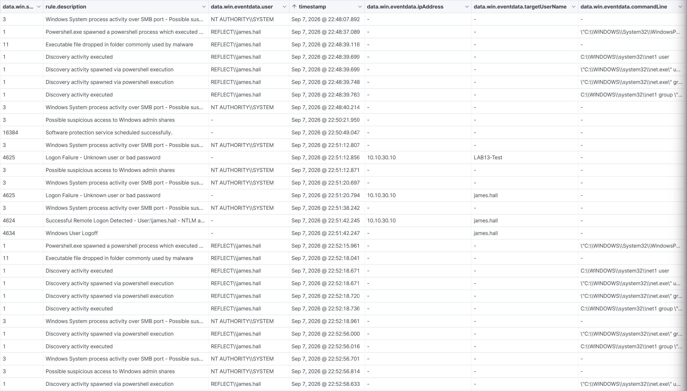
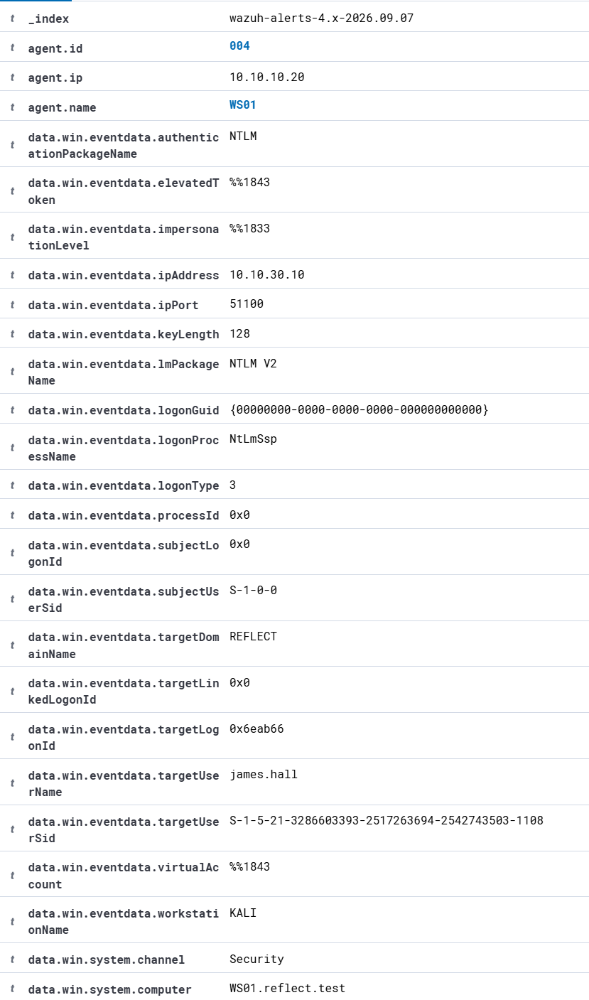
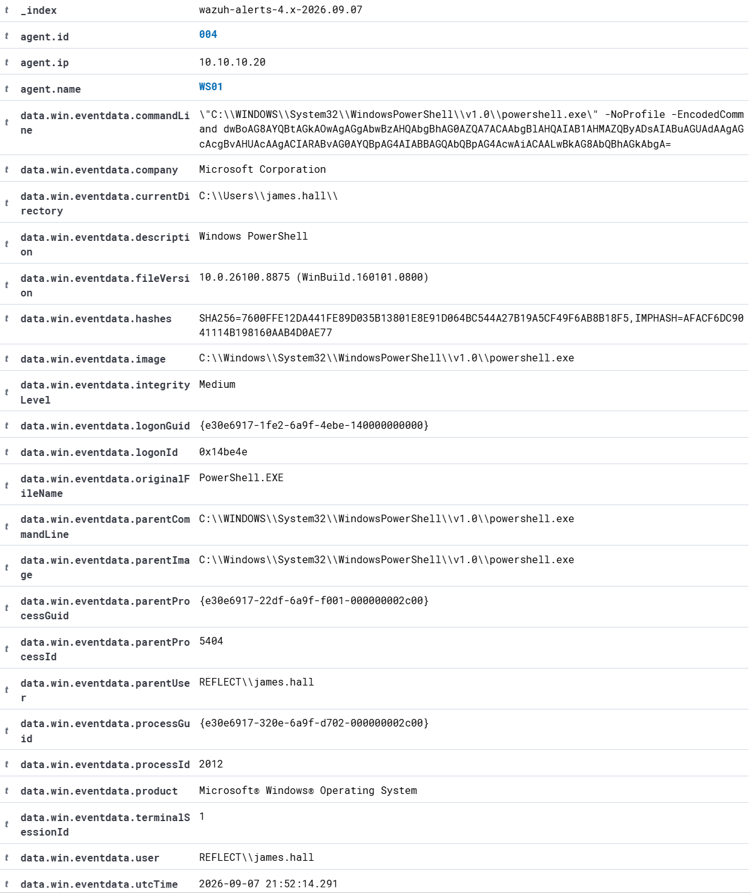
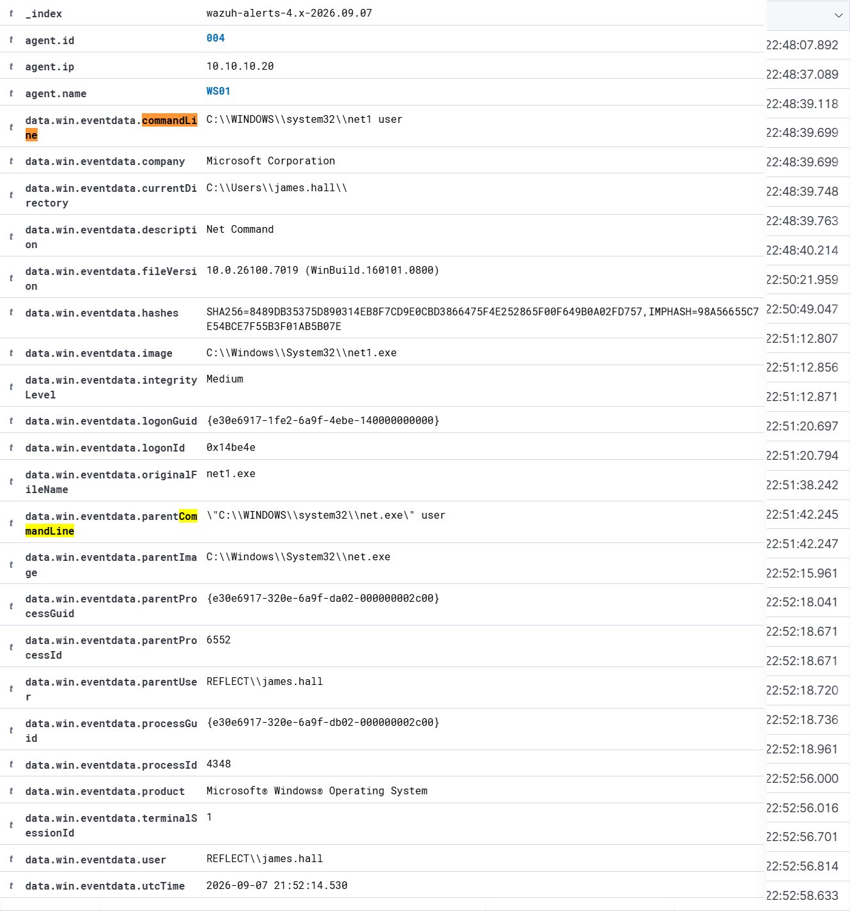
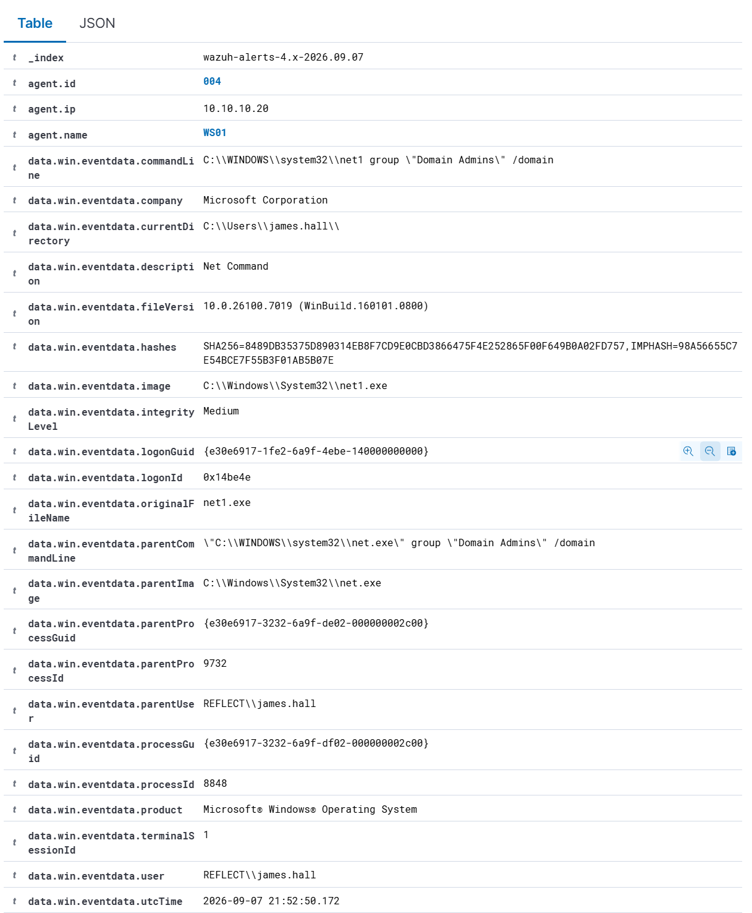
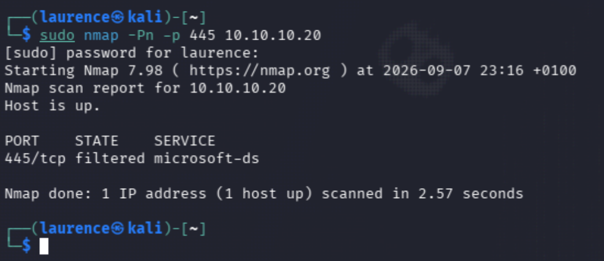

# Lab 13 - Suspicious SMB Authentication Followed by Encoded PowerShell Discovery on WS01

## Overview

This lab documents a completed SOC investigation in the segmented `reflect.test` environment: suspicious SMB authentication, successful use of a domain account, encoded PowerShell execution, account discovery, privileged-group discovery, and verified containment.

**All activity was controlled and performed against owned systems in an isolated VMware lab.** The authentication tests originated from Kali. The subsequent execution and discovery were deliberately simulated locally on WS01 as `REFLECT\james.hall`. No production systems or third-party targets were involved.

The workflow covered:

```text
Detect → Triage → Correlate → Investigate → ATT&CK map → Contain → Verify
```

This investigation builds on [Lab 11 - Active Directory Security Monitoring](https://github.com/lozzabigsby/cybersecurity-labs/blob/main/lab-11-active-directory-wazuh-detection.md) and the segmented architecture established in [Lab 12 - Operation Blackout](https://github.com/lozzabigsby/cybersecurity-labs/blob/main/lab-12-operation-blackout.md).

---

## Executive Summary

On 7 September 2026, Kali (`10.10.30.10`) generated two failed network authentications to WS01 (`10.10.10.20`), followed by a successful NTLM network logon using `james.hall`. Shortly afterwards, endpoint telemetry recorded encoded PowerShell and discovery activity under `REFLECT\james.hall` on WS01.

Wazuh preserved the source address, account, logon type, process command lines, and timestamps needed to reconstruct the activity. The combined authentication and discovery behaviour was assessed as **High initial severity**.

The temporary pfSense and Windows Firewall SMB exceptions were then removed. At **23:16 BST**, a validation scan from Kali reported **`445/tcp filtered microsoft-ds`**, confirming that the tested SMB path was filtered again.

| Incident field | Assessment |
|---|---|
| Incident reference | Lab 13 |
| Date | 7 September 2026 |
| Affected endpoint | WS01 / `10.10.10.20` |
| Source | Kali / `10.10.30.10` |
| Principal account | `REFLECT\james.hall` |
| Initial analyst severity | High; based on combined behaviour and network context |
| Final disposition | Authorised simulation; temporary SMB exposure contained and tested |
| Confirmed impact | Successful network authentication and controlled local execution/discovery |

---

## Lab Objective

1. Correlate Windows authentication and Sysmon process telemetry in Wazuh.
2. Identify the source, endpoint, account, commands, and timing of a simulated incident.
3. Validate underlying event fields instead of relying on alert descriptions alone.
4. Assign a defensible severity and map evidenced behaviour to MITRE ATT&CK.
5. Remove the deliberate SMB exposure and verify the result from the Attack network.
6. Document monitoring reliability issues and evidence limitations alongside the findings.

---

## Architecture

Lab 13 reused the segmented Lab 12 environment, with separate Corporate, Security, and Attack networks controlled by pfSense.



| Zone | Subnet | Relevant systems and purpose |
|---|---|---|
| Corporate / VMnet2 | `10.10.10.0/24` | DC01, WS01, and ADM01; domain services and endpoints |
| Security / VMnet3 | `10.10.20.0/24` | Wazuh manager, indexer, and dashboard at `10.10.20.10` |
| Attack / VMnet4 | `10.10.30.0/24` | Kali at `10.10.30.10`; controlled testing and validation |

pfSense provided routing and default-deny Attack-to-Corporate policy. The exercise temporarily allowed only Kali-to-WS01 TCP/445 through both pfSense and the workstation firewall. The inherited VMware NAT/WAN connection supported lab maintenance; the scenario targets remained on the isolated internal segments.

### Tools and Evidence Sources

- VMware Workstation and pfSense
- Active Directory, Windows Security auditing, and Windows Defender Firewall
- Sysmon process-creation telemetry and Wazuh investigation views
- Kali Linux, `smbclient`, and Nmap
- Original screenshots and the contemporaneous investigation record

---

## Phase 1 - Controlled Attack Narrative

With the temporary SMB exceptions in place, `smbclient` share enumeration generated three authentication events:

1. A failed logon using the synthetic account `LAB13-Test`.
2. A failed logon using `james.hall` and an incorrect password.
3. A successful logon using the valid lab credentials for `james.hall`.

The successful network logon was followed by an expected logoff as the share-enumeration operation completed.

A local PowerShell session on WS01 was then used to simulate post-compromise execution as `REFLECT\james.hall`. Encoded PowerShell, `net user`, and `net group "Domain Admins" /domain` generated the execution and discovery telemetry for investigation. This activity was launched locally; the SMB session did not remotely execute PowerShell.

---

## Phase 2 - Incident Timeline

All local times below are **7 September 2026, BST (UTC+01:00)**. The time-basis column distinguishes Wazuh's displayed `timestamp` from Sysmon's embedded `utcTime`.

| Local time | Time basis | Event and evidence | Analyst interpretation |
|---|---|---|---|
| 22:51:12.856 | Wazuh displayed timestamp | Security `4625`; `LAB13-Test`; source `10.10.30.10` | First controlled failed network authentication |
| 22:51:20.794 | Wazuh displayed timestamp | Security `4625`; `james.hall`; same source | Second controlled failure, now targeting the valid lab account |
| 22:51:42.245 | Wazuh displayed timestamp | Security `4624`; `james.hall`; source `10.10.30.10` | Successful NTLM network logon; Logon Type `3` |
| 22:51:42.247 | Wazuh displayed timestamp | Security `4634`; `james.hall` | Expected logoff following `smbclient` share enumeration |
| 22:52:14.291 | Sysmon `utcTime` = `21:52:14.291` | Encoded PowerShell under `REFLECT\james.hall` | Source process-creation time for the locally simulated execution |
| 22:52:14.530 | Sysmon `utcTime` = `21:52:14.530` | `net1 user`, parent `net.exe`, same account | Account discovery captured at the endpoint |
| ~22:52:15; displayed 22:52:15.961 | Wazuh displayed timestamp | PowerShell execution alert under `REFLECT\james.hall` | Dashboard evidence of the encoded execution |
| 22:52:18.671 | Wazuh displayed timestamp | Account-discovery rows for `net.exe` / `net1.exe` | Dashboard discovery evidence; do not treat each row as a separate operator action |
| 22:52:50.172 | Sysmon `utcTime` = `21:52:50.172` | `net1 group "Domain Admins" /domain` | Later privileged domain-group discovery |
| 23:16 | Kali scan output, minute precision | `445/tcp filtered microsoft-ds` | Containment validation after removal of the temporary exceptions |

Sysmon places PowerShell execution at 22:52:14.291 and account discovery at 22:52:14.530. Wazuh displays the corresponding activity around 22:52:15–18. These different time fields explain the apparent ordering discrepancy; the cause of the delay was not established.



The screenshot also includes earlier test activity around 22:48–22:50. The final incident run begins at **22:51:12.856**.

---

## Phase 3 - Analyst Triage and Correlation

### Initial Severity: High

The initial assessment was High because:

- A source in the Attack zone successfully authenticated across a normally denied boundary.
- Authentication used a valid domain identity on a Corporate endpoint.
- The same endpoint and account then appeared in encoded PowerShell and discovery telemetry.
- Enumeration targeted both accounts and a privileged domain group.

Together, these events warranted treating the account and workstation as potentially compromised until the authorised simulation was confirmed. The rating was an analyst assessment of the combined activity, separate from individual Wazuh rule levels.

### IOCs and Investigation Entities

The following entities were used to correlate the lab events.

| Entity | Value | Relevance |
|---|---|---|
| Source host / address | KALI / `10.10.30.10` | SMB authentication source and containment-test origin |
| Target host / address | WS01 / `10.10.10.20` | Authentication destination and local process telemetry source |
| Domain account | `REFLECT\james.hall` | Successful network authentication and local execution context |
| Synthetic test account | `LAB13-Test` | First failed authentication |
| Service | TCP/445 / SMB | Temporary exposure under investigation |
| Execution indicator | `powershell.exe -NoProfile -EncodedCommand` | Encoded execution requiring contextual analysis |
| Discovery commands | `net user`; `net group "Domain Admins" /domain` | Account and privileged-group enumeration |

### Authentication Findings

The expanded `4624` confirmed the authentication details:

| Field | Evidence |
|---|---|
| Target | WS01 / `10.10.10.20` |
| Account | `REFLECT\james.hall` |
| Source | `10.10.30.10` / `KALI` |
| Logon type | `3` - Network |
| Authentication package | `NTLM` |
| LM package | `NTLM V2` |



The two failures were controlled authentication attempts, not evidence of brute force or password spraying. The successful attempt used known lab credentials.

### Execution and Discovery Findings

The expanded PowerShell record showed `powershell.exe` launched by `powershell.exe`, the `-NoProfile -EncodedCommand` arguments, Medium integrity, and user `REFLECT\james.hall`.



The account-discovery record shows `C:\WINDOWS\system32\net1 user`, with `net.exe` as its parent and `REFLECT\james.hall` as both user and parent user. This directly supports Account Discovery, beyond the Wazuh rule description.



The privileged-group record showed `C:\WINDOWS\system32\net1 group "Domain Admins" /domain`, again under `REFLECT\james.hall` with parent `net.exe`. This confirmed execution of the privileged domain-group query.



The SMB logon ID was `0x6eab66`, while the local execution records used `0x14be4e`. The events were therefore correlated by host, account, timing, and test context, without claiming a shared logon session or remote-execution chain.

Other alerts for possible administrative-share access and file creation remained outside the confirmed findings because their underlying objects were not investigated in this report.

---

## MITRE ATT&CK Mapping

| Observed behaviour | Technique | Evidence |
|---|---|---|
| Successful use of the valid lab account | **T1078 - Valid Accounts** | Successful `4624` for `james.hall` |
| Encoded PowerShell execution | **T1059.001 - Command and Scripting Interpreter: PowerShell** | Process command line and account context on WS01 |
| Account enumeration | **T1087 - Account Discovery** | `net user` / `net1 user` process evidence |
| Domain Admins group query | **T1069.002 - Permission Groups Discovery: Domain Groups** | `net group "Domain Admins" /domain` and corresponding `net1` record |

The mappings reflect the confirmed simulation behaviour. The final Nmap scan was a defensive containment check and is excluded from attacker reconnaissance mapping.

---

## Phase 4 - Containment and Verification

After investigation, both temporary SMB exceptions were removed and the path was tested from Kali.

1. In **pfSense → Firewall → Rules → ATTACK**, remove or disable `LAB13 - TEMP Kali to WS01 SMB` and apply changes, restoring the original Attack-to-Corporate block policy for this path.
2. On WS01, remove the temporary Windows Firewall exception from an elevated PowerShell session:

```powershell
Remove-NetFirewallRule -DisplayName "LAB13 TEMP SMB from Kali"
```

3. Check for a remaining rule with the same display name:

```powershell
Get-NetFirewallRule -DisplayName "LAB13 TEMP SMB from Kali" -ErrorAction SilentlyContinue
```

The rule check should return no matching entry. The retained containment evidence is the final scan below.

4. From Kali, validate only the lab WS01 SMB endpoint:

```bash
sudo nmap -Pn -p 445 10.10.10.20
```

At **23:16 +0100**, Nmap reported:

```text
PORT    STATE    SERVICE
445/tcp filtered microsoft-ds
```



The scan confirmed a filtered result for the Kali-to-WS01 SMB path. Validation covered this source, destination, and port. Because `-Pn` skips host discovery, the “Host is up” line was not used as evidence of host responsiveness.

---

## Lessons Learned and Improvements

### 1. Correlation needs more than timing

Account, host, logon ID, and process context made it possible to explain the activity accurately. Future investigations should preserve these fields alongside the alert timeline.

### 2. Source timestamps matter

Retain both Wazuh display time and Sysmon process time, with a stated timezone. Source timestamps and process identifiers provide the stronger basis for detailed sequencing.

### 3. Wazuh agent buffer flooding is a monitoring-reliability issue

Earlier preparation encountered Wazuh agent buffer flooding amid background Windows and security-tool activity. Recovery was recorded before the final run, although the exact configuration change and any event loss were not captured in this evidence set.

A connected agent does not guarantee complete or timely collection. Monitor queue warnings, compare endpoint events with SIEM arrival, and retain before-and-after health checks when tuning event volume. Preserve the Security and Sysmon sources needed for investigation.

### 4. Alert labels need validation

Expanded command lines confirmed the discovery activity behind Wazuh's alert labels. Reviewing those fields helped separate evidenced behaviour from generic malware-related descriptions.

### 5. Containment should have an observable outcome

The final Kali scan provided a clear containment result. Keep temporary exceptions narrow, record their expiry, and test from the original source after removing them.

---

## Scope and Limitations

- All activity took place in the owned, isolated VMware environment using the Lab 12 architecture.
- The report covers the final run beginning at 22:51:12.856 and its containment validation; screenshots are selected evidence rather than a complete forensic acquisition.
- Discovery telemetry proves command execution, but does not establish returned group membership, sensitive-data access, or privilege changes.
- Credential theft, malware deployment, persistence, exfiltration, and domain compromise were not established.

---

## Skills Demonstrated

- SOC triage and incident severity assessment
- Windows Security authentication analysis
- Sysmon command-line and process-context investigation
- Wazuh timeline correlation and telemetry-health awareness
- Evidence-based MITRE ATT&CK mapping
- pfSense and Windows Firewall containment
- Validation from the originating network segment
- Clear separation of observed facts, operator context, and analyst inference

---

## Conclusion

Lab 13 successfully investigated a controlled sequence of failed authentication, valid-account access, encoded PowerShell, and discovery on WS01. Windows Security and Sysmon telemetry provided the attribution and command detail needed for triage and MITRE mapping.

Both temporary SMB exceptions were removed, and the final scan at 23:16 confirmed TCP/445 was filtered from Kali. The completed workflow demonstrates practical SOC investigation, evidence interpretation, containment, and monitoring-reliability awareness.
