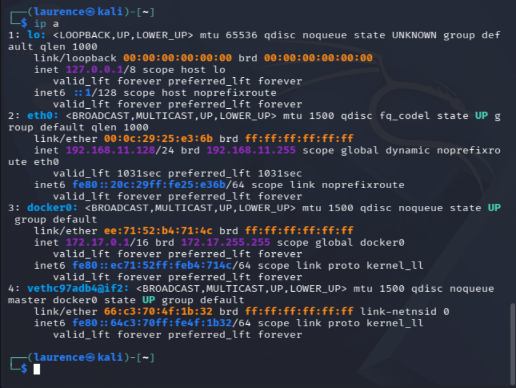
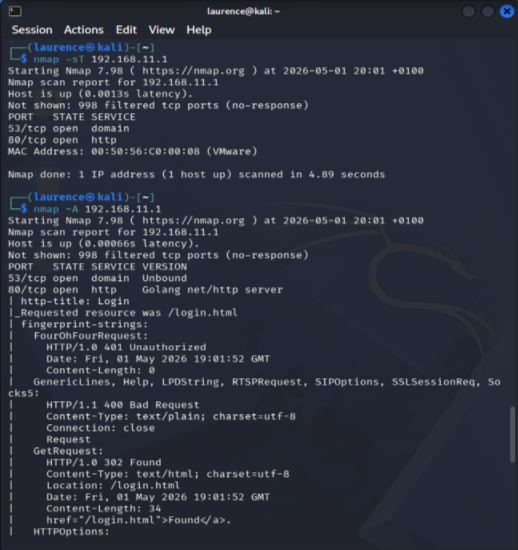
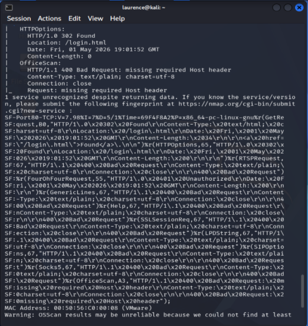
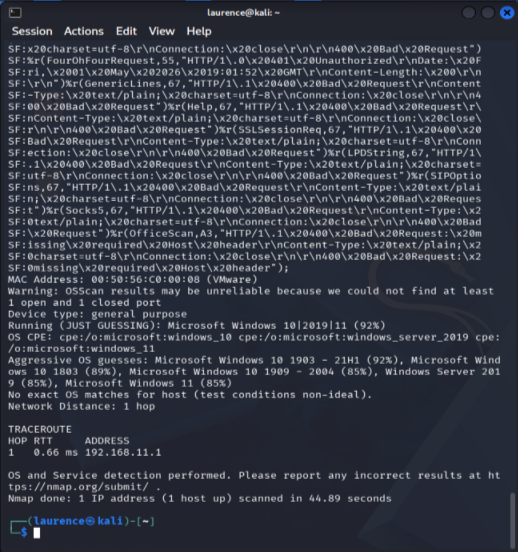
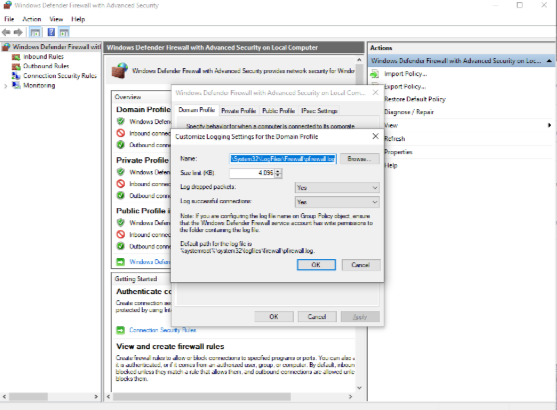
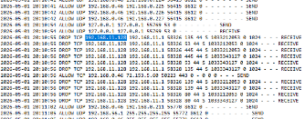

# Windows Firewall Detection of Nmap Scan

## Overview
This lab demonstrates how a Windows machine can detect network scanning activity using built-in firewall logging.

A Kali Linux machine was used to perform an Nmap scan against a Windows host. Firewall logs were then analysed to identify evidence of the scan.

---

## Lab Setup

Attacker Machine:
- Kali Linux
- IP Address: 192.168.11.128

Target Machine:
- Windows
- IP Address: 192.168.11.1

Network:
- VM NAT network (192.168.11.0/24)

---

## Tools Used

- Nmap (Kali Linux)
- Windows Defender Firewall
- pfirewall.log

---

## Reconnaissance (Nmap Scan)

An Nmap scan was performed against the target machine:

nmap -A 192.168.11.1

Results:
- Port 80/tcp open (HTTP)
- Port 53/tcp open (DNS)
- Service detection identified a Golang HTTP server and Unbound DNS
- OS detection suggested Windows 10 / Server 2019

---

## Firewall Logging Configuration

Windows Defender Firewall logging was enabled to capture both allowed and dropped traffic.

Log settings:
- Log dropped packets: Enabled
- Log successful connections: Enabled
- Log file: C:\Windows\System32\LogFiles\Firewall\pfirewall.log

---

## Detection (Firewall Logs)

Analysis of the firewall logs revealed multiple dropped connection attempts from the attacker machine.

Example:
DROP TCP 192.168.11.128 → 192.168.11.1

These entries indicate that the Windows firewall detected and blocked scanning activity originating from the Kali machine.

---

## Conclusion

This lab demonstrates how basic reconnaissance activity can be detected using native Windows logging.

Even simple Nmap scans generate identifiable patterns in firewall logs, providing visibility into potential malicious activity.

## Nmap Scan Results

---

## Firewall Logging Enabled

---

## Detection in Firewall Logs

