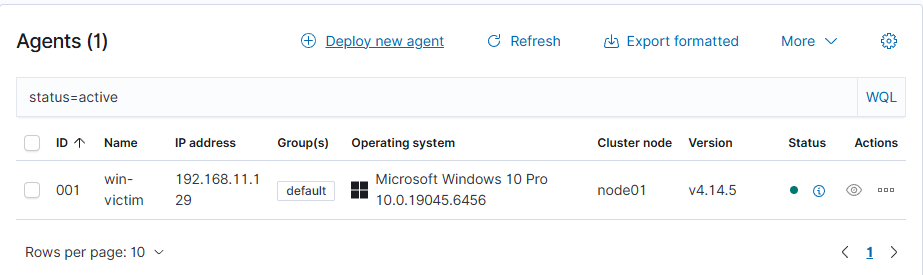
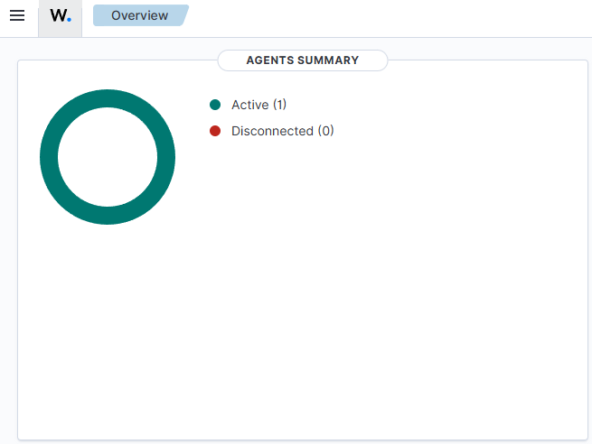
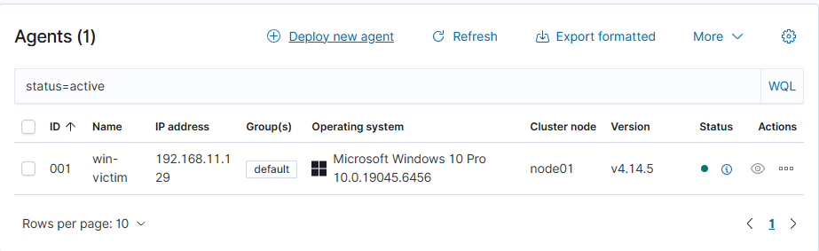
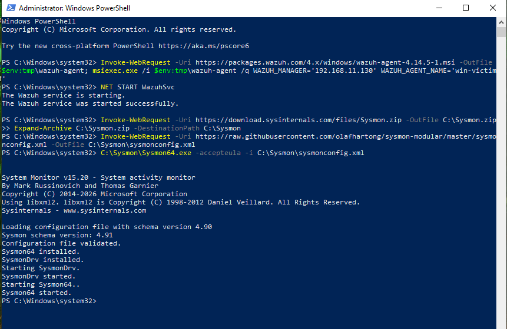
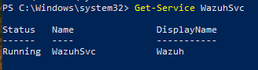
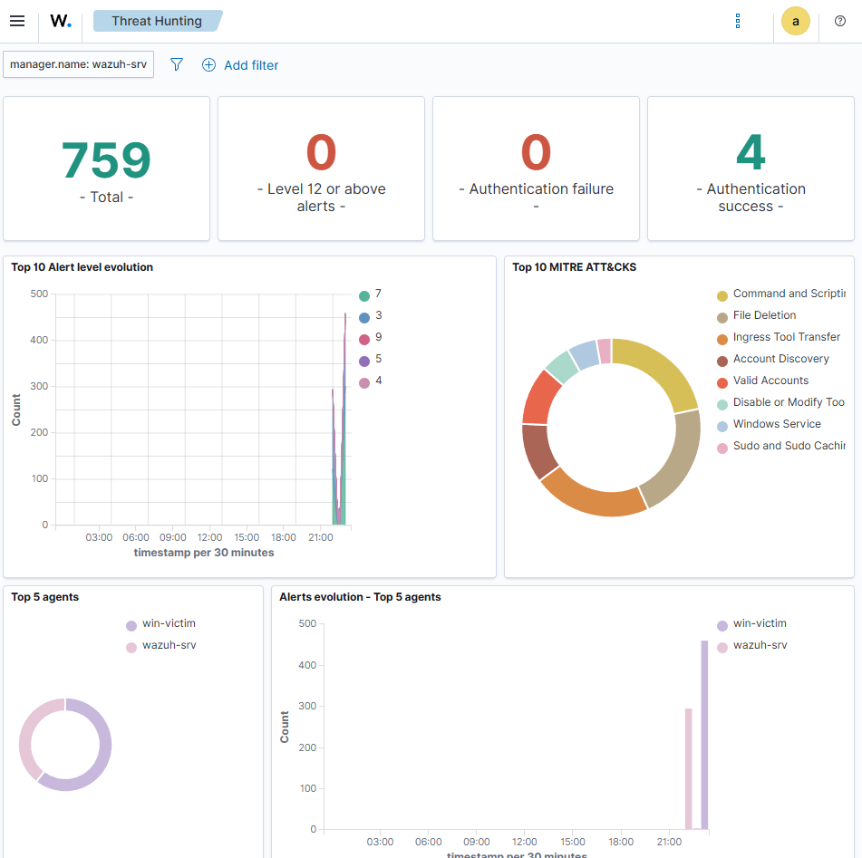
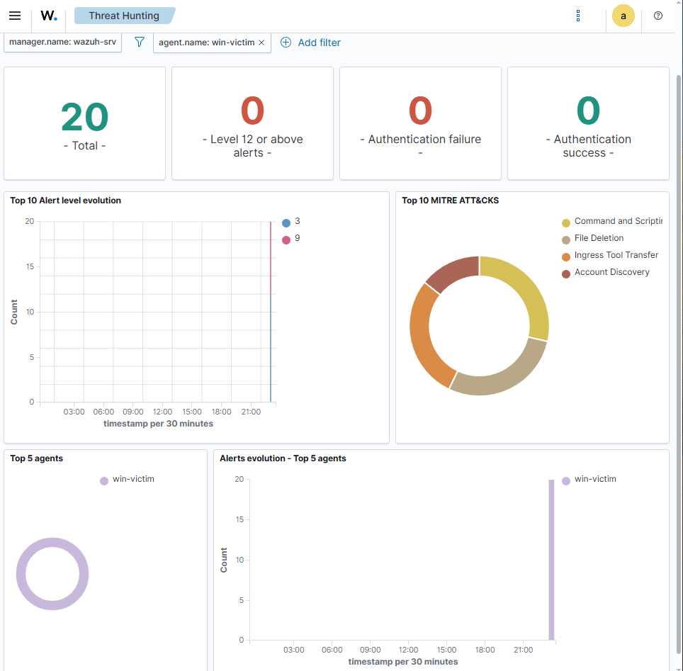
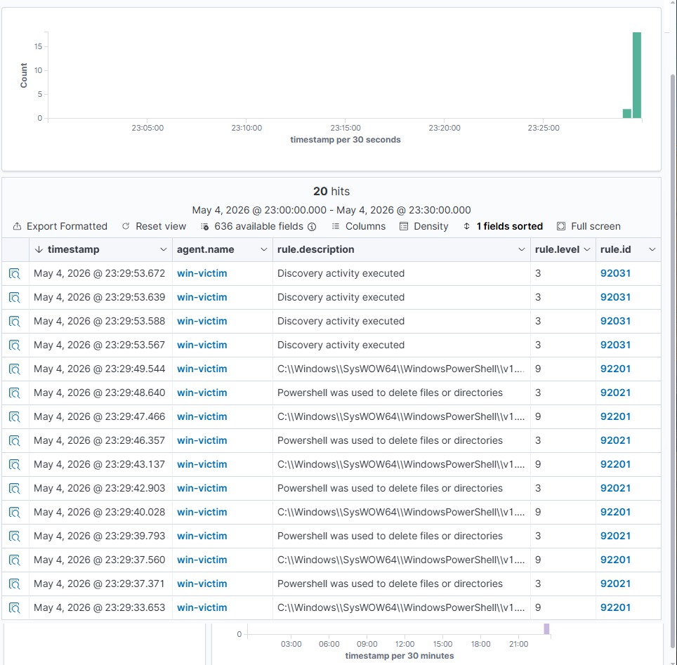
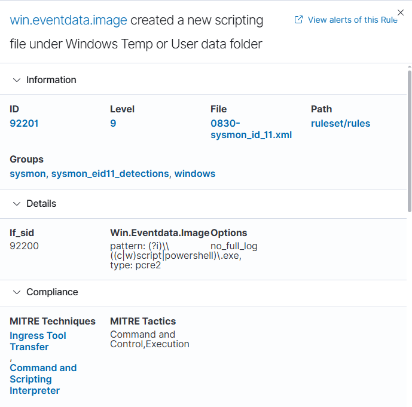

# Lab 6 - Scenario 1: Suspicious PowerShell Investigation

## Objective

Investigate suspicious PowerShell activity from a Windows virtual machine using Wazuh, Sysmon, and Windows event logs.

This scenario demonstrates a beginner SOC-style endpoint investigation workflow: confirm telemetry, search for relevant events, expand alerts, and collect evidence.

---

## Tools Used

- Wazuh
- Wazuh Dashboard
- VMware Workstation Pro
- Windows VM
- Wazuh Windows agent
- Sysmon
- PowerShell
- Windows Event Logs

---

## Lab Summary

PowerShell activity was generated on a Windows VM and reviewed through the Wazuh dashboard.

Sysmon was used to improve endpoint visibility by collecting detailed Windows event data. Wazuh was then used to search and review this activity from a central dashboard.

The purpose of this lab was to understand how PowerShell-related activity appears inside Wazuh and how endpoint telemetry can be reviewed during a basic security investigation.

---

## Investigation Steps

1. Confirmed that the Windows VM was connected to the Wazuh manager.
2. Verified that the Wazuh Windows agent service was running.
3. Installed and configured Sysmon on the Windows VM.
4. Generated PowerShell activity on the Windows machine.
5. Opened the Wazuh dashboard.
6. Searched for PowerShell-related activity.
7. Reviewed Wazuh threat hunting alerts from the Windows victim machine.
8. Expanded Sysmon event details to inspect rule and event data.
9. Captured screenshots as evidence of the investigation.

---

## Evidence Collected

### 00 - Wazuh Agents Overview

### 01 - Wazuh Dashboard

### 02 - Windows Agent Service Started

### 03 - Sysmon Installed

### 04 - Wazuh Service Running After Sysmon Configuration

### 05 - Threat Hunting Alerts

### 06 - Sysmon Search Results

### 07 - PowerShell Alerts in Wazuh

### 08 - Expanded Sysmon Rule Details

---

## Findings

The lab confirmed that the Windows VM was sending security event data into Wazuh.

PowerShell-related activity could be searched and reviewed inside the Wazuh dashboard.

Sysmon improved the level of endpoint visibility available for investigation.

The expanded event view provided more detail than the summary table view, including useful Wazuh rule and event information.

---

## Analyst Notes

This lab showed that investigation data can vary depending on how tools are configured and how dashboard fields are displayed.

A useful analyst workflow is to expand the full event, review the available fields, and capture evidence that supports the investigation.

---

## Conclusion

This scenario demonstrated a practical suspicious PowerShell investigation using Wazuh and Sysmon.

The lab involved monitoring endpoint telemetry, analysing security events, and identifying PowerShell activity within a controlled virtual lab environment.

This provides practical evidence of endpoint monitoring, log analysis, alert investigation, and SOC-style security event analysis using Wazuh and Sysmon.

---

## Skills Demonstrated

- Wazuh dashboard investigation
- Windows endpoint monitoring
- Sysmon log collection
- PowerShell activity analysis
- Basic SOC investigation workflow
- Security event searching
- Alert expansion and rule review
- Evidence collection through screenshots
