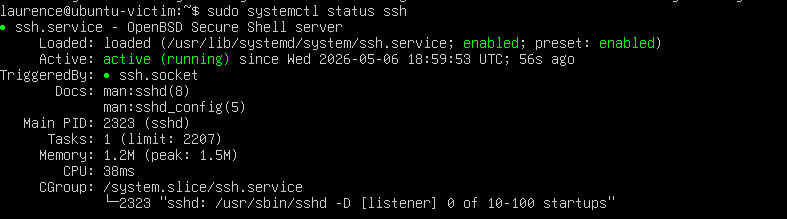
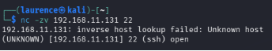
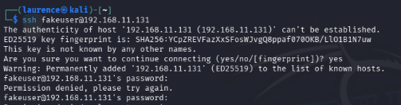
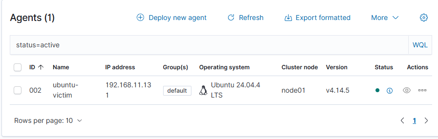
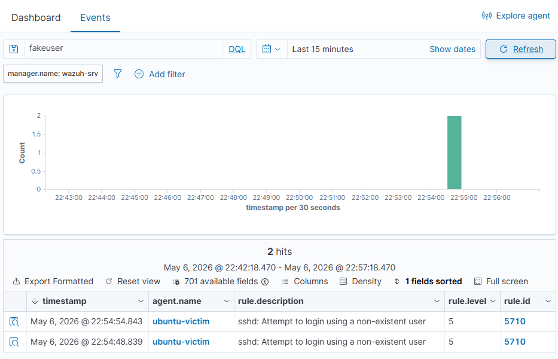

# Lab 7 - Scenario 2: SSH Brute Force Detection

## Objective

Simulate SSH authentication activity against an Ubuntu Linux victim machine and confirm that the activity could be detected and investigated inside Wazuh.

This scenario practises a beginner SOC workflow: confirm the target service is running, generate controlled failed SSH login activity, review local Linux authentication logs, and confirm that Wazuh received and displayed the security event.

---

## Tools Used

- Wazuh
- Wazuh Dashboard
- Ubuntu Linux victim machine
- Kali Linux attacker machine
- VMware Workstation Pro
- SSH
- Hydra
- Linux authentication logs
- PowerShell
- Local lab network

---

## Lab Summary

An Ubuntu Linux victim machine was configured with SSH enabled and reachable on the lab network.

Kali Linux was used to test connectivity to the victim machine and confirm that port 22 was open. A small password list was prepared, and Hydra was used to generate controlled SSH login attempts.

The failed SSH authentication activity was reviewed locally on the Ubuntu victim using authentication logs. The Wazuh Ubuntu agent was confirmed as active, and the failed SSH authentication alert was then reviewed inside the Wazuh dashboard.

This demonstrated how SSH brute-force style activity can be generated, logged, forwarded, and investigated through Wazuh.

---

## Investigation Steps

1. Confirmed that SSH was active on the Ubuntu victim machine.
2. Confirmed connectivity from Kali to the Ubuntu victim.
3. Confirmed that SSH port `22` was open.
4. Created a small password list for controlled testing.
5. Used Hydra to attempt SSH logins against the victim machine.
6. Generated a single failed SSH login attempt for clearer evidence.
7. Confirmed that the Wazuh Ubuntu agent was active.
8. Reviewed the Ubuntu authentication log for the failed login activity.
9. Expanded the Wazuh server disk to support the lab environment.
10. Reviewed the SSH authentication failure alert in Wazuh.
11. Expanded the Wazuh alert details to identify source IP information.

---

## Evidence Collected

### 01 - Victim SSH Active



### 02 - Kali Ping to Victim


### 03 - SSH Port Open



### 04 - Password List


### 05 - Hydra SSH Brute Force Attempt


### 06 - Single Failed SSH Login



### 07 - Wazuh Ubuntu Agent Active



### 08 - Victim SSH Auth Log


### 09 - Wazuh Disk Expanded


### 10 - Wazuh SSH Authentication Failure Alert



### 11 - Wazuh Alert Details Source IP


---

## Commands Used

### Check Wazuh API

```bash
curl -sk -H "Authorization: Bearer $TOKEN" https://127.0.0.1:55000/
```

### Example SSH Testing Workflow

```bash
ping 192.168.11.131
nmap -p 22 192.168.11.131
hydra -l fakeuser -P passwords.txt ssh://192.168.11.131
```

---

## Findings

The Ubuntu victim machine was reachable from Kali on the lab network.

SSH was active on the victim machine, and port `22` was open.

Controlled failed SSH login activity was generated using Hydra and manual SSH testing.

The failed authentication activity appeared in the Ubuntu authentication logs.

The Wazuh Ubuntu agent was active, and Wazuh displayed an SSH authentication failure alert.

The expanded Wazuh alert details provided additional investigation context, including source IP information.

---

## Security Relevance

SSH brute-force activity is a common attack pattern against Linux systems.

Attackers often attempt repeated username and password combinations against exposed SSH services. Even when the attack does not succeed, the failed authentication attempts can provide useful detection evidence.

Monitoring SSH authentication failures is important because it can help identify brute-force attempts, password spraying, exposed remote access services, and repeated failed logins from suspicious source IPs.

---

## Troubleshooting Notes

During the lab, some Wazuh and SSH connectivity issues appeared, including dashboard loading problems and an SSH connection reset.

The correct approach was to verify the environment layer by layer: API, dashboard, victim connectivity, SSH service, Wazuh agent, local Linux logs, and Wazuh alerts.

---

## Analyst Notes

This lab showed that a detection workflow depends on both attack simulation and reliable telemetry.

It was not enough to simply run Hydra. The activity had to be verified locally on the victim machine and then confirmed inside Wazuh.

---

## Conclusion

This lab demonstrated an SSH brute-force detection workflow using Kali Linux, an Ubuntu victim machine, and Wazuh.

The exercise focused on generating failed authentication activity, reviewing Linux authentication logs, and analysing Wazuh alerts within a controlled lab environment.

This provides practical evidence of Linux log analysis, Wazuh alert investigation, SSH authentication monitoring, and SOC-style security event investigation.

---

## Skills Demonstrated

- SSH service validation
- Linux victim investigation
- Kali-to-Linux connectivity testing
- Nmap port checking
- Hydra controlled brute-force testing
- Linux authentication log review
- Wazuh agent verification
- Wazuh alert investigation
- Source IP review
- Evidence collection through screenshots
- SOC-style brute-force detection workflow
