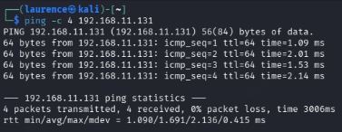
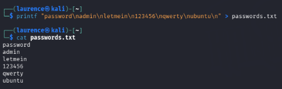
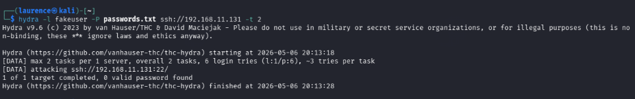
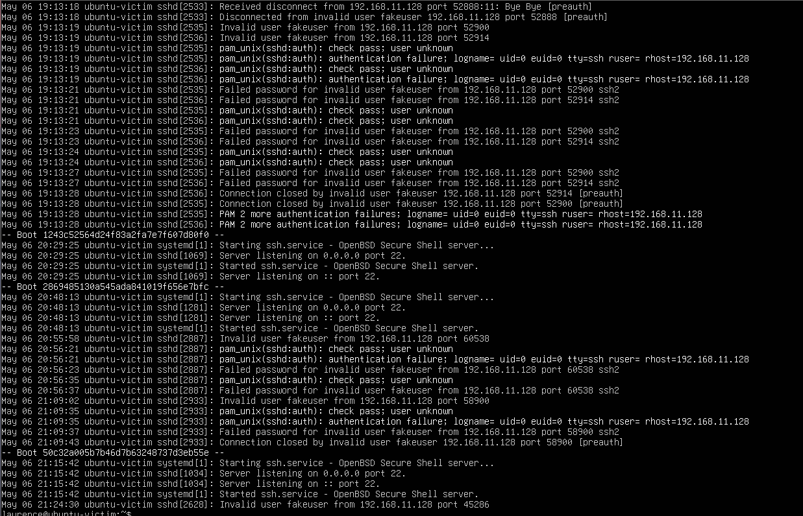
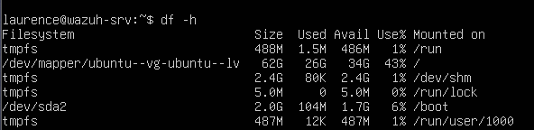
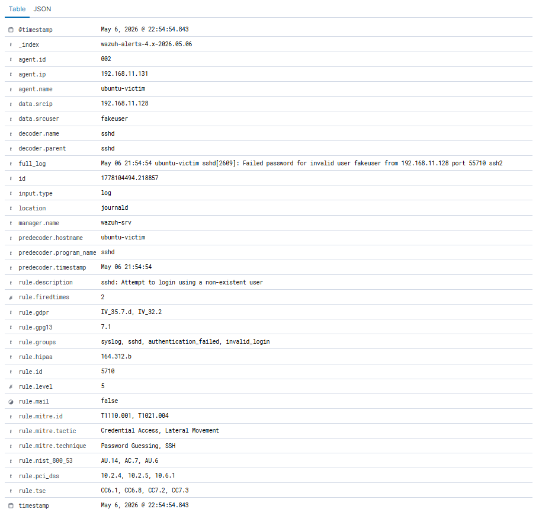

# Lab 7: Wazuh SOC Lab - Phase 2: SSH Brute Force Detection

## Objective

The objective of this lab was to simulate SSH authentication activity against an Ubuntu Linux victim machine and confirm that the activity could be detected and investigated inside Wazuh.

This lab was designed to practise a basic SOC workflow: confirm the target service is running, generate controlled failed SSH login activity, review local Linux authentication logs, and then confirm that Wazuh received and displayed the security event.

---

## Tools Used

- Wazuh
- Wazuh Dashboard
- Ubuntu Linux victim machine
- Kali Linux attacker machine
- VMware Workstation Pro
- SSH
- Hydra
- Linux authentication logs
- PowerShell
- Local lab network

---

## Lab Summary

In this scenario, an Ubuntu Linux victim machine was configured with SSH enabled and reachable on the lab network.

Kali Linux was used to test connectivity to the victim machine and confirm that port 22 was open. A small password list was then prepared and Hydra was used to generate controlled SSH login attempts.

The failed SSH authentication activity was reviewed locally on the Ubuntu victim using authentication logs. The Wazuh Ubuntu agent was confirmed as active, and the failed SSH authentication alert was then reviewed inside the Wazuh dashboard.

This demonstrated how SSH brute-force style activity can be generated, logged, forwarded, and investigated through Wazuh.

---

## Investigation Steps

1. Confirmed that SSH was active on the Ubuntu victim machine.
2. Confirmed connectivity from Kali to the Ubuntu victim.
3. Confirmed that SSH port `22` was open.
4. Created a small password list for controlled testing.
5. Used Hydra to attempt SSH logins against the victim machine.
6. Generated a single failed SSH login attempt for clearer evidence.
7. Confirmed that the Wazuh Ubuntu agent was active.
8. Reviewed the Ubuntu authentication log for the failed login activity.
9. Expanded the Wazuh server disk to support the lab environment.
10. Reviewed the SSH authentication failure alert in Wazuh.
11. Expanded the Wazuh alert details to identify source IP information.

---

## Evidence Collected

### 01 - Victim SSH Active

This screenshot shows that SSH was active on the Ubuntu victim machine.


### 02 - Kali Ping to Victim

This screenshot shows Kali successfully pinging the Ubuntu victim machine, confirming basic network connectivity.



### 03 - SSH Port Open

This screenshot shows that SSH port `22` was open on the victim machine.


### 04 - Password List

This screenshot shows the password list used for controlled SSH testing.



### 05 - Hydra SSH Brute Force Attempt

This screenshot shows Hydra being used to generate controlled SSH login attempts against the victim machine.



### 06 - Single Failed SSH Login

This screenshot shows a single failed SSH login attempt, useful for clearer evidence and easier investigation.


### 07 - Wazuh Ubuntu Agent Active

This screenshot shows the Ubuntu victim agent active in Wazuh.


### 08 - Victim SSH Auth Log

This screenshot shows the failed SSH login activity inside the Ubuntu victim authentication log.



### 09 - Wazuh Disk Expanded

This screenshot shows the Wazuh disk expanded to support the lab environment.



### 10 - Wazuh SSH Authentication Failure Alert

This screenshot shows the SSH authentication failure alert inside Wazuh.


### 11 - Wazuh Alert Details Source IP

This screenshot shows the expanded Wazuh alert details, including source IP information.



---

## Commands Used

### Check Wazuh API

```bash
curl -sk -H "Authorization: Bearer $TOKEN" https://127.0.0.1:55000/
```

This command was used during troubleshooting to confirm whether the Wazuh API was responding locally on the Wazuh server.

### Example SSH Testing Workflow

```bash
ping 192.168.11.131
nmap -p 22 192.168.11.131
hydra -l fakeuser -P passwords.txt ssh://192.168.11.131
```

These commands represent the basic workflow used to confirm connectivity, check SSH exposure, and generate controlled failed authentication activity.

---

## Findings

The Ubuntu victim machine was reachable from Kali on the lab network.

SSH was active on the victim machine, and port `22` was open.

Controlled failed SSH login activity was generated using Hydra and manual SSH testing.

The failed authentication activity appeared in the Ubuntu authentication logs.

The Wazuh Ubuntu agent was active, and Wazuh displayed an SSH authentication failure alert.

The expanded Wazuh alert details provided additional investigation context, including source IP information.

---

## Security Relevance

SSH brute-force activity is a common attack pattern against Linux systems.

Attackers often attempt repeated username and password combinations against exposed SSH services. Even when the attack does not succeed, the failed authentication attempts can provide useful detection evidence.

Monitoring SSH authentication failures is important because it can help identify:

- Brute-force attempts
- Password spraying
- Reconnaissance against Linux servers
- Exposed remote access services
- Repeated failed logins from suspicious source IPs
- Early signs of attacker activity

In a real SOC environment, analysts would review the source IP, username attempted, number of failures, affected host, time range, and whether any successful login followed the failed attempts.

---

## Troubleshooting Notes

During the lab, some Wazuh and SSH connectivity issues appeared, including dashboard loading problems and an SSH connection reset.

The correct approach was to verify the environment layer by layer:

- Check whether the Wazuh API responded
- Confirm the dashboard loaded
- Confirm the victim machine was reachable
- Confirm SSH was running
- Confirm the agent was active
- Confirm local Linux logs showed the activity
- Confirm Wazuh displayed the alert

This helped separate real detection issues from lab environment problems.

---

## Analyst Notes

This lab showed that a detection workflow depends on both attack simulation and reliable telemetry.

It was not enough to simply run Hydra. The activity had to be verified locally on the victim machine and then confirmed inside Wazuh.

The screenshots provide evidence across the full chain:

1. SSH service available
2. Kali connectivity confirmed
3. Failed authentication generated
4. Local Linux log evidence captured
5. Wazuh agent active
6. Wazuh alert reviewed
7. Alert details expanded for source IP context

This is a useful beginner SOC investigation because it follows the same logic an analyst would use when validating a brute-force alert.

---

## Conclusion

This lab demonstrated a basic SSH brute-force detection workflow using Kali Linux, an Ubuntu victim machine, and Wazuh.

The lab confirmed that failed SSH authentication activity could be generated, logged on the Linux victim, forwarded by the Wazuh agent, and reviewed in the Wazuh dashboard.

This provides practical evidence of Linux log review, Wazuh alert investigation, SSH authentication analysis, and controlled attack simulation in a lab environment.

---

## Skills Demonstrated

- SSH service validation
- Linux victim investigation
- Kali-to-Linux connectivity testing
- Nmap port checking
- Hydra controlled brute-force testing
- Linux authentication log review
- Wazuh agent verification
- Wazuh alert investigation
- Source IP review
- Evidence collection through screenshots
- SOC-style brute-force detection workflow
