# Lab 8 - Scenario 3: Wazuh File Integrity Monitoring and Web Shell Detection

## Objective

Configure Wazuh File Integrity Monitoring on an Ubuntu web server and confirm that file creation and file modification activity inside the Apache web directory can be detected and investigated in the Wazuh dashboard.

This scenario practises a SOC-style defensive monitoring workflow. The lab focuses on monitoring a web server directory, creating controlled test files, simulating a suspicious PHP file being dropped, and reviewing the resulting Wazuh syscheck alerts.

---

## Tools Used

- Wazuh
- Wazuh Dashboard
- Wazuh agent
- Ubuntu Linux victim machine
- Apache2 web server
- VMware Workstation Pro
- Linux terminal
- Wazuh File Integrity Monitoring
- Local lab network

---

## Lab Environment

| Component | Details |
|---|---|
| Wazuh server | `192.168.11.130` |
| Ubuntu victim | `192.168.11.131` |
| Web service | Apache2 |
| Monitored directory | `/var/www/html` |
| Detection source | Wazuh syscheck / File Integrity Monitoring |

---

## Lab Summary

Apache2 was installed and started on the Ubuntu victim machine. The default Apache page was accessed from the host browser to confirm that the web server was reachable across the lab network.

The Wazuh agent on the Ubuntu victim was confirmed as active. The agent configuration was then updated so that Wazuh File Integrity Monitoring watched the Apache web directory at `/var/www/html` in realtime.

A test file named `fim-test.txt` was created inside the monitored web directory. Wazuh generated a syscheck alert showing that a file had been added.

A suspicious PHP file named `shell.php` was then created to simulate a web shell being dropped into the web root. Wazuh detected the file creation and displayed the file path in the alert details.

The `shell.php` file was then modified using a controlled timestamp update. Wazuh generated an integrity change alert, showing that the file had been modified.

---

## Investigation Steps

1. Confirmed the Ubuntu victim IP address.
2. Installed and started Apache2 on the Ubuntu victim.
3. Confirmed the Apache default page loaded from the host browser.
4. Confirmed the Wazuh agent was active on the Ubuntu victim.
5. Edited the Wazuh agent `ossec.conf` file.
6. Added `/var/www/html` to the Wazuh syscheck monitored directories.
7. Restarted the Wazuh agent to apply the configuration change.
8. Created `fim-test.txt` inside `/var/www/html`.
9. Confirmed Wazuh detected the test file creation.
10. Created `shell.php` inside `/var/www/html` to simulate a suspicious PHP file drop.
11. Confirmed Wazuh detected the suspicious PHP file creation.
12. Modified `shell.php` using a controlled timestamp update.
13. Confirmed Wazuh detected the file integrity change.
14. Reviewed Wazuh alert details for path, event type, rule groups, and MITRE mapping.

---

## Evidence Collected

### 01 - Apache Running

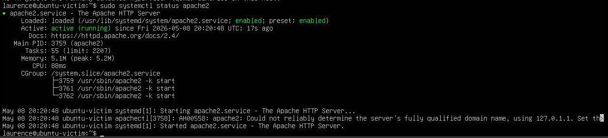

### 02 - Apache Browser Test

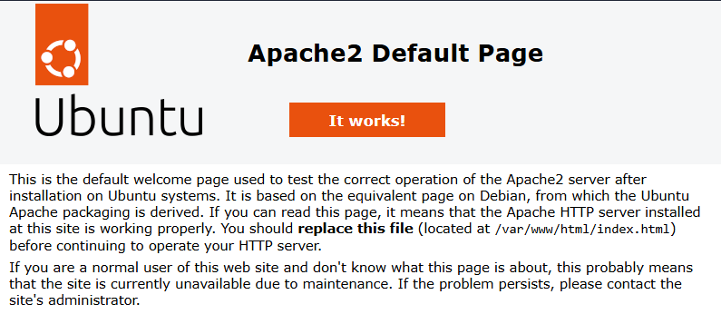

### 03 - Wazuh Agent Running

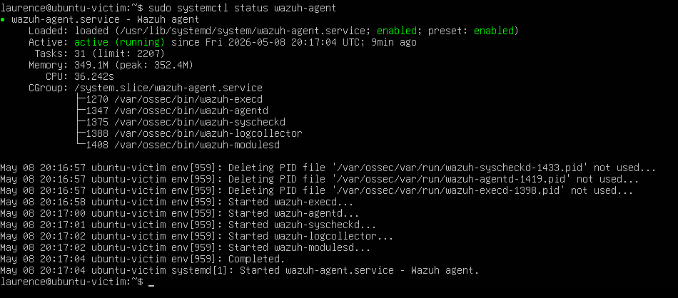

### 04 - Wazuh FIM Configuration

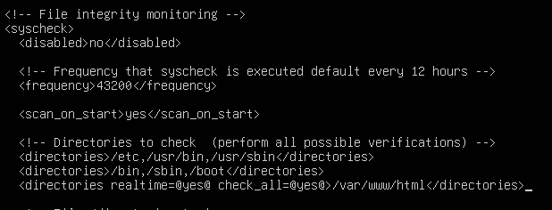

### 05 - Wazuh Agent Restarted

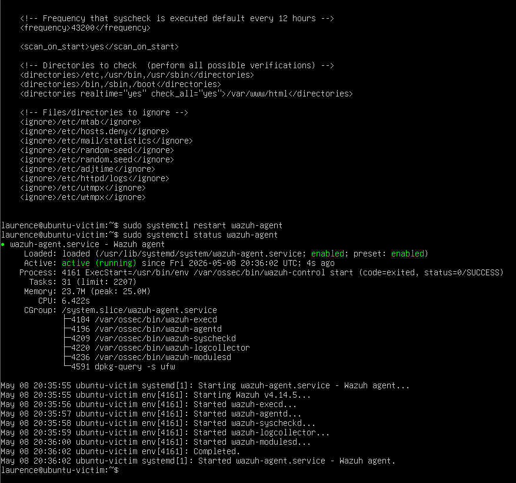

### 06 - FIM Test File Created

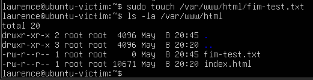

### 07 - Wazuh FIM Alert

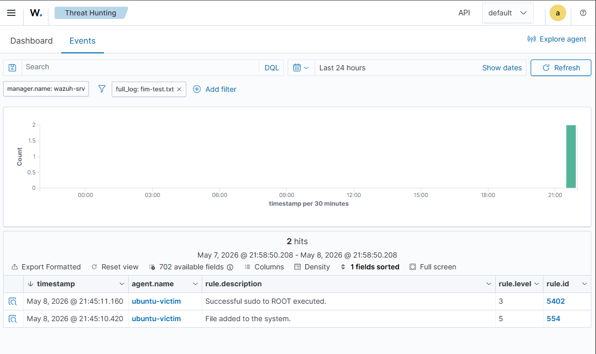

### 08 - Wazuh FIM Alert Details

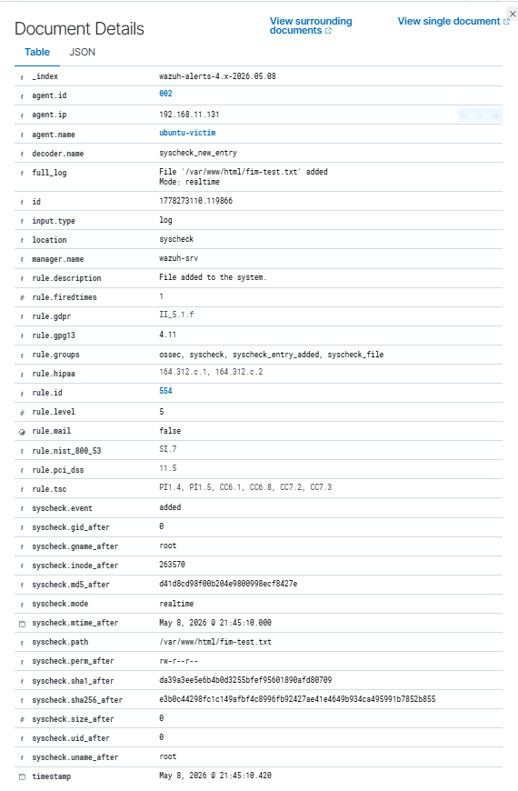

### 09 - Web Shell File Created

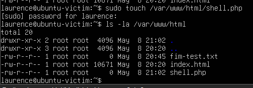

### 10 - Wazuh Web Shell Alert

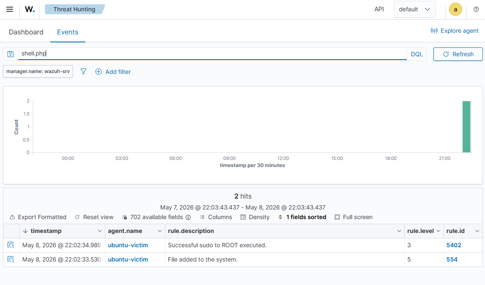

### 11 - Wazuh Web Shell Alert Details

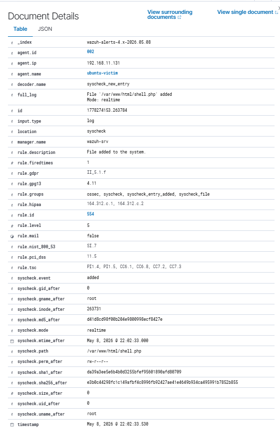

### 12 - Web Shell File Modified in Terminal

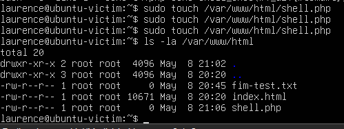

### 13 - Wazuh Web Shell Modified Alert

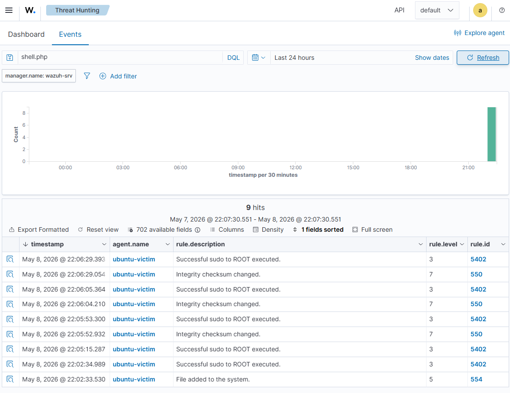

### 14 - Wazuh Web Shell Modified Alert Details

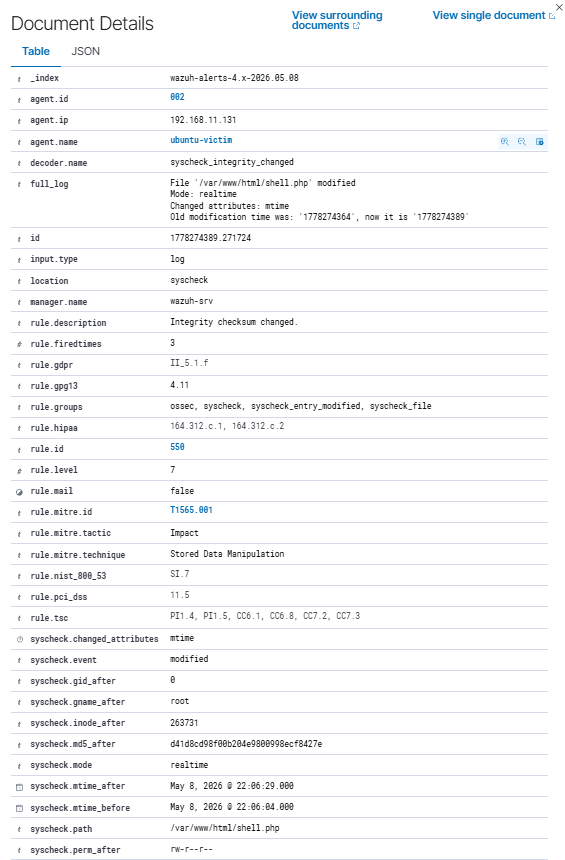

---

## Commands Used

### Check Apache Status

```bash
sudo systemctl status apache2
```

### Test Apache Locally

```bash
curl http://localhost
```

### Check Wazuh Agent Status

```bash
sudo systemctl status wazuh-agent
```

### Edit Wazuh Agent Configuration

```bash
sudo nano /var/ossec/etc/ossec.conf
```

### Wazuh FIM Configuration Added

```xml
<directories realtime="yes" check_all="yes">/var/www/html</directories>
```

### Restart Wazuh Agent

```bash
sudo systemctl restart wazuh-agent
sudo systemctl status wazuh-agent
```

### Create FIM Test File

```bash
sudo touch /var/www/html/fim-test.txt
ls -la /var/www/html
```

### Create Simulated Web Shell File

```bash
sudo touch /var/www/html/shell.php
ls -la /var/www/html
```

### Modify Simulated Web Shell File

```bash
sudo touch /var/www/html/shell.php
ls -la /var/www/html
```

### Cleanup

```bash
sudo rm /var/www/html/fim-test.txt /var/www/html/shell.php
ls -la /var/www/html
```

---

## Wazuh Alert Findings

### Test File Creation

Wazuh detected the creation of `fim-test.txt` inside the monitored Apache web directory.

Key fields observed:

- `agent.name`: `ubuntu-victim`
- `rule.description`: `File added to the system.`
- `rule.id`: `554`
- `rule.groups`: `ossec`, `syscheck`, `syscheck_entry_added`, `syscheck_file`
- `syscheck.event`: `added`
- `syscheck.path`: `/var/www/html/fim-test.txt`

### Suspicious PHP File Creation

Wazuh detected the creation of `shell.php` inside the Apache web root.

Key fields observed:

- `agent.name`: `ubuntu-victim`
- `rule.description`: `File added to the system.`
- `rule.id`: `554`
- `rule.groups`: `ossec`, `syscheck`, `syscheck_entry_added`, `syscheck_file`
- `syscheck.event`: `added`
- `syscheck.path`: `/var/www/html/shell.php`

### Suspicious File Modification

Wazuh detected a change to the `shell.php` file.

Key fields observed:

- `agent.name`: `ubuntu-victim`
- `rule.description`: `Integrity checksum changed.`
- `rule.id`: `550`
- `rule.groups`: `ossec`, `syscheck`, `syscheck_entry_modified`, `syscheck_file`
- `syscheck.event`: `modified`
- `syscheck.changed_attributes`: `mtime`
- `syscheck.path`: `/var/www/html/shell.php`
- `rule.mitre.technique`: `Stored Data Manipulation`

---

## Security Relevance

File Integrity Monitoring is important for web servers because attackers may attempt to upload or modify files after gaining access to an application, exposed upload function, weak credential, vulnerable plugin, or misconfigured web service.

A suspicious PHP file appearing inside a web root can indicate attempted web shell activity. Even if the file is empty or harmless in a lab, the detection workflow is realistic because defenders need to know when new executable web files appear in sensitive directories.

Monitoring file additions and file changes in `/var/www/html` can help detect:

- Web shell uploads
- Unauthorized web content changes
- Defacement attempts
- Persistence through modified web files
- Suspicious PHP files in public web directories
- Post-exploitation file staging

---

## Troubleshooting Notes

During the lab, special characters were being altered when copied into the terminal. Quotation marks were converted into other symbols, which caused command issues.

The lab was adjusted by using simpler commands such as `touch` so the focus stayed on the detection objective instead of fighting terminal input problems.

The detection remained valid because Wazuh File Integrity Monitoring detects file creation and file metadata changes, even when a test file is empty.

---

## Analyst Notes

The key investigation value came from expanding the Wazuh alert details.

The event list showed that activity occurred, but the alert details confirmed the monitored path, event type, Wazuh rule, syscheck group, and MITRE mapping.

This is an important SOC habit: do not stop at the headline alert. Open the event and confirm the fields that prove what happened.

---

## Conclusion

This lab demonstrated a Wazuh File Integrity Monitoring workflow on an Ubuntu Apache web server.

The exercise showed that Wazuh could detect a file added to the web directory, a simulated suspicious PHP file being created, and later modification activity against that file.

This provides practical evidence of Linux web server monitoring, Wazuh syscheck configuration, threat hunting, alert review, and SOC-style investigation of possible web shell activity.

---

## Skills Demonstrated

- Apache2 service validation
- Linux web server monitoring
- Wazuh agent configuration
- Wazuh File Integrity Monitoring
- Realtime monitoring of `/var/www/html`
- Detection of file creation events
- Detection of file modification events
- Wazuh Threat Hunting dashboard usage
- Syscheck alert investigation
- Evidence collection through screenshots
- MITRE ATT&CK context review
- SOC-style investigation workflow
