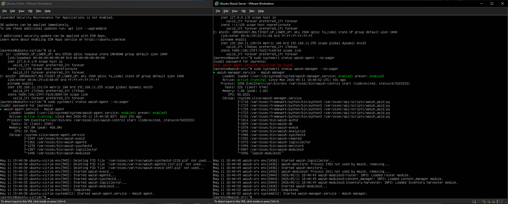
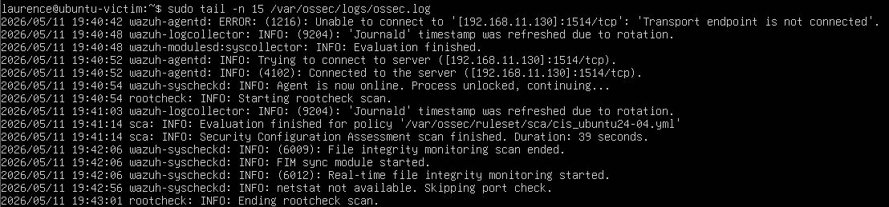
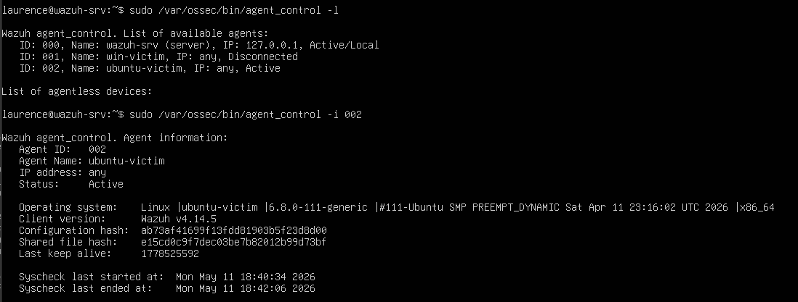
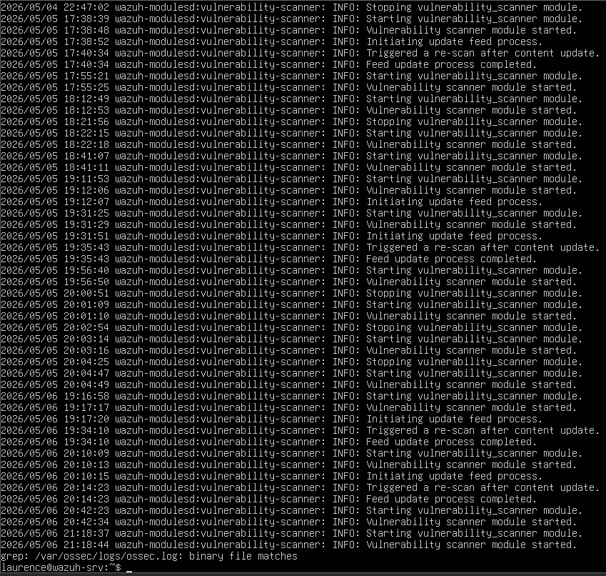
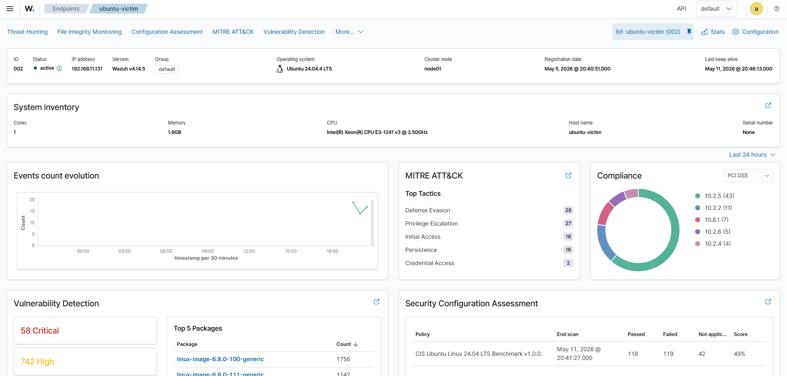
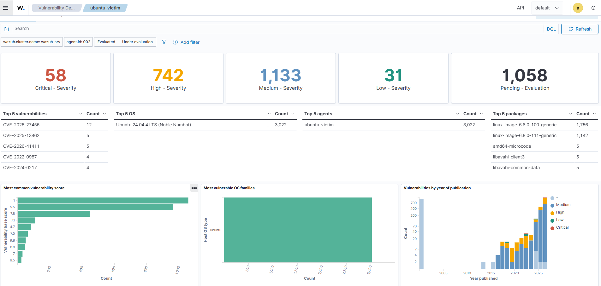
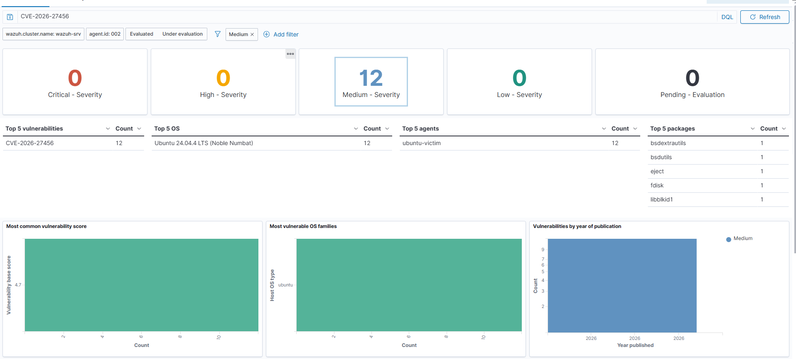
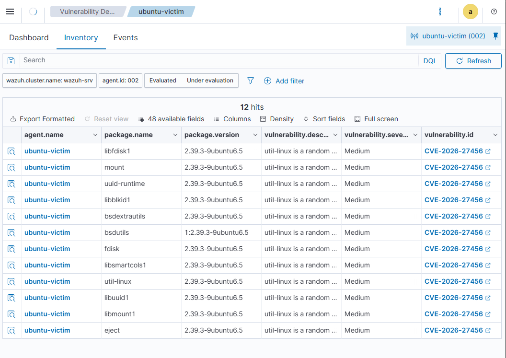
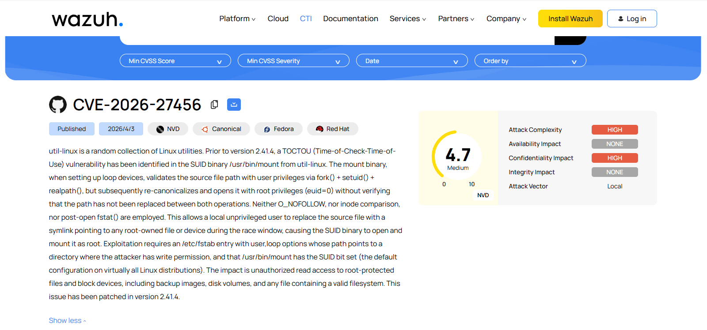

# Lab 9 - Wazuh Vulnerability Detection and CVE Investigation

## Objective

Use Wazuh Vulnerability Detection to identify vulnerable packages on an Ubuntu endpoint, review the vulnerability inventory, filter findings by CVE, and document one specific CVE using Wazuh CTI.

This lab practises a SOC-style vulnerability management workflow. The focus is detection, triage, evidence collection, and understanding how endpoint software inventory links to known CVEs.

---

## Tools Used

- Wazuh
- Wazuh Dashboard
- Wazuh agent
- Wazuh Vulnerability Detection
- Wazuh CTI
- Ubuntu Linux victim machine
- VMware Workstation Pro
- Linux terminal
- Local lab network

---

## Lab Environment

| Component | Details |
|---|---|
| Wazuh server | `192.168.11.130` |
| Ubuntu victim | `192.168.11.131` |
| Agent ID | `002` |
| Agent name | `ubuntu-victim` |
| Operating system | Ubuntu 24.04.4 LTS |
| Wazuh agent version | 4.14.5 |
| Detection source | Wazuh Vulnerability Detection |
| External reference source | Wazuh CTI |

---

## Lab Summary

The Wazuh server and Ubuntu victim were started in VMware Workstation Pro. The Ubuntu victim was confirmed as an active Wazuh agent and visible in the Wazuh Dashboard.

The Wazuh vulnerability scanner module was checked from the Wazuh server logs. The logs confirmed that the vulnerability scanner module started, initiated the update feed process, completed the feed update, and triggered re-scans after content updates.

The Ubuntu victim was then reviewed in the Wazuh Dashboard under Vulnerability Detection. Wazuh detected vulnerabilities on the endpoint and grouped them by severity, operating system, affected agent, vulnerable package, and year of publication.

A focused investigation was performed on `CVE-2026-27456`. The dashboard was filtered to show only that CVE and medium severity findings. Wazuh returned 12 matching findings affecting util-linux related packages on the Ubuntu victim.

The inventory view was used to confirm affected package names, package versions, severity, and CVE ID. The Wazuh CTI reference for `CVE-2026-27456` was then reviewed to document the CVSS score, severity, impact, and remediation context.

---

## Investigation Steps

1. Started the Wazuh server VM and Ubuntu victim VM.
2. Confirmed the Wazuh manager, indexer, and dashboard services were active.
3. Confirmed the Ubuntu victim Wazuh agent was active and connected.
4. Checked the Wazuh vulnerability scanner module in `/var/ossec/logs/ossec.log`.
5. Confirmed the vulnerability feed update process completed.
6. Opened the Wazuh Dashboard and selected the Ubuntu victim agent.
7. Reviewed the agent summary for `ubuntu-victim`.
8. Opened the Vulnerability Detection dashboard.
9. Reviewed vulnerability counts by severity.
10. Filtered the dashboard to investigate `CVE-2026-27456`.
11. Opened the vulnerability inventory table.
12. Confirmed affected packages, installed versions, severity, and CVE ID.
13. Opened the Wazuh CTI reference for the CVE.
14. Documented the CVE details and recommended remediation approach.

---

## Evidence Collected

### 01 - Environment Running



### 02 - Ubuntu Agent Configured and Connected



### 03 - Agent Active on Wazuh Server



### 04 - Vulnerability Scanner Running



### 05 - Ubuntu Agent Dashboard Summary



### 06 - Vulnerabilities Detected Dashboard



### 07 - CVE Filtered Results



### 08 - Vulnerability Inventory Table



### 09 - External CVE Reference in Wazuh CTI



---

## Commands Used

### Check Wazuh Services

```bash
sudo systemctl status wazuh-manager --no-pager
sudo systemctl status wazuh-indexer --no-pager
sudo systemctl status wazuh-dashboard --no-pager
```

### List Connected Wazuh Agents

```bash
sudo /var/ossec/bin/agent_control -l
```

### Inspect the Ubuntu Victim Agent

```bash
sudo /var/ossec/bin/agent_control -i 002
```

### Check Wazuh Agent Status on Ubuntu Victim

```bash
sudo systemctl status wazuh-agent --no-pager
```

### Check Wazuh Agent Logs

```bash
sudo tail -n 30 /var/ossec/logs/ossec.log
```

### Check Vulnerability Scanner Log Entries

```bash
sudo grep -i vulnerability /var/ossec/logs/ossec.log
```

---

## Wazuh Findings

The Wazuh Vulnerability Detection dashboard showed vulnerability findings for the Ubuntu victim endpoint.

Key dashboard observations:

- `agent.name`: `ubuntu-victim`
- `agent.id`: `002`
- Operating system: Ubuntu 24.04.4 LTS
- Vulnerability scanner module: running
- Vulnerability feed update process: completed
- Vulnerability data available in the dashboard
- Findings grouped by severity, package, OS, and agent

The dashboard initially showed vulnerability findings across several severity levels, including critical, high, medium, and low severity results.

---

## CVE Investigated

A focused investigation was performed on:

```text
CVE-2026-27456
```

Wazuh showed this CVE as a medium severity finding on the Ubuntu victim.

### Wazuh Inventory Fields Observed

Key fields observed in the vulnerability inventory table:

- `agent.name`: `ubuntu-victim`
- `package.name`: util-linux related packages
- `package.version`: `2.39.3-9ubuntu6.5`
- `vulnerability.severity`: `Medium`
- `vulnerability.id`: `CVE-2026-27456`

### Example Affected Packages Observed

The filtered inventory view showed 12 matching results. Example affected packages included:

- `libfdisk1`
- `mount`
- `uuid-runtime`
- `libblkid1`
- `bsdextrautils`
- `bsdutils`
- `fdisk`
- `libsmartcols1`
- `util-linux`
- `libuuid1`
- `libmount1`
- `eject`

---

## External CVE Reference Review

The Wazuh CTI page for `CVE-2026-27456` was reviewed to understand the vulnerability outside of the dashboard finding.

Key details observed:

| Field | Value |
|---|---|
| CVE | `CVE-2026-27456` |
| Source | Wazuh CTI |
| CVSS score | 4.7 |
| Severity | Medium |
| Attack vector | Local |
| Attack complexity | High |
| Confidentiality impact | High |
| Integrity impact | None |
| Availability impact | None |
| Affected software family | util-linux / mount |
| Patched version referenced | util-linux 2.41.4 |

---

## Risk Explanation

This finding is not a simple remote attack path by itself. The attack vector is local and the attack complexity is high.

The finding still matters because local vulnerabilities can become important after an attacker already has some level of access to a system. From a SOC and vulnerability management perspective, this type of finding should be reviewed, prioritised, and remediated based on severity, exposure, business criticality, and vendor guidance.

---

## Recommended Remediation

Recommended remediation actions:

1. Review vendor guidance for `CVE-2026-27456`.
2. Check whether the affected util-linux packages are required on the endpoint.
3. Apply Ubuntu security updates when a fixed package is available.
4. Reboot the endpoint if the package update requires it.
5. Re-run or wait for the Wazuh vulnerability scan to refresh.
6. Confirm the CVE no longer appears in the Wazuh vulnerability inventory after remediation.

---

## Troubleshooting Notes

During the lab, the Wazuh indexer temporarily reported read-only index blocks after a previous disk watermark event. The VM disk was checked and confirmed to have available space. The Wazuh server RAM was then increased to improve stability.

A keyboard layout mismatch also affected terminal input. Some special characters did not match the physical keyboard. Commands were adjusted during the lab to avoid unnecessary input errors.

These issues were useful troubleshooting practice because vulnerability management tools depend on healthy indexing, storage, agent connectivity, and dashboard availability.

---

## Analyst Notes

The main investigation value came from linking four layers of evidence together:

1. The Wazuh scanner logs proved that vulnerability scanning was running.
2. The Wazuh dashboard proved that vulnerability data existed for the Ubuntu victim.
3. The inventory table linked the CVE to specific installed packages and versions.
4. The Wazuh CTI page explained the vulnerability context and severity.

This is the correct workflow for a junior SOC or vulnerability analyst. Do not stop at a dashboard count. Confirm which asset is affected, which package is vulnerable, which version is installed, how severe the issue is, and what the recommended remediation path should be.

---

## Conclusion

This lab demonstrated a Wazuh Vulnerability Detection workflow against an Ubuntu endpoint.

The Ubuntu victim was connected as an active Wazuh agent, the vulnerability scanner module was confirmed as running, vulnerability findings were reviewed in the Wazuh Dashboard, and a specific CVE was investigated using both Wazuh inventory data and Wazuh CTI.

The lab provides practical evidence of vulnerability detection, CVE triage, package-level investigation, and SOC-style documentation.

---

## Skills Demonstrated

- Wazuh agent validation
- Wazuh Vulnerability Detection
- Vulnerability scanner log review
- Wazuh Dashboard investigation
- CVE filtering
- Package-level vulnerability analysis
- CVSS and severity review
- Wazuh CTI usage
- Vulnerability triage
- Security evidence collection
- SOC-style documentation
