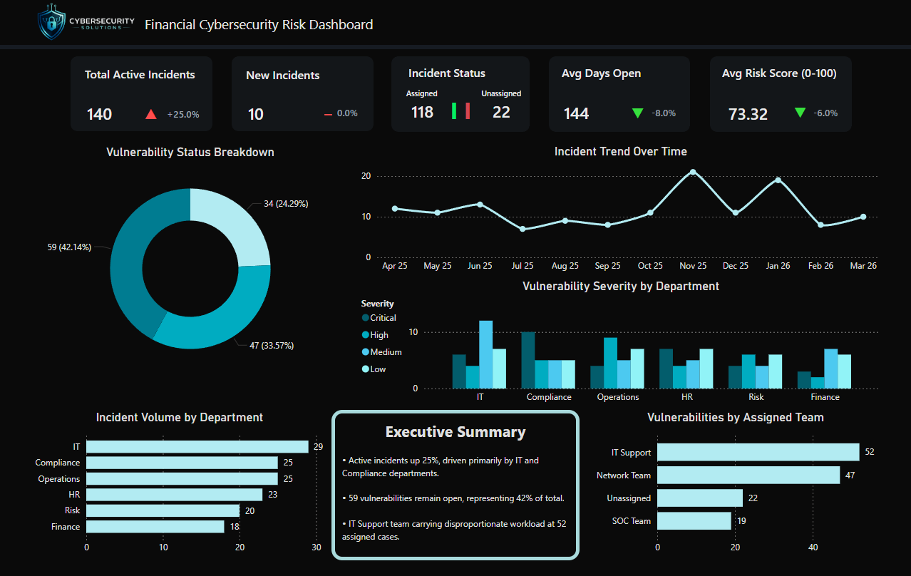

# Financial Cybersecurity Risk Dashboard

## Project Overview

This Power BI dashboard demonstrates how cybersecurity incident and vulnerability data can be turned into executive-level risk reporting for a financial services environment.

The dashboard focuses on helping security and business stakeholders understand current cyber risk, incident workload, response trends, and areas that may need faster escalation or remediation.

## Dashboard Walkthrough

[Watch the dashboard demo video](./screenshots/Financial%20Cybersecurity%20Risk%20Dashboard.mp4)

## Dashboard File

- `Financial_Services_Vulnerability_Report.pbix`

## Business Problem

Financial services organisations need clear visibility over cyber risk because they handle sensitive customer data, financial records, regulatory obligations, and high-value operational systems.

Security data is often spread across tools, tickets, vulnerability scanners, spreadsheets, and incident reports. This dashboard brings that type of information into one reporting view so leaders can quickly understand:

- how many incidents are active
- whether incident volume is increasing
- which incidents are open, closed, assigned, or unassigned
- how long incidents remain open
- how overall risk is trending
- where response delays may exist

## Key Reporting Areas

- Active incidents
- New incidents
- Incident status
- Average days open
- Average risk score
- Trend indicators
- Incident distribution
- Severity and operational risk views
- Executive summary insights

## Tools Used

- Power BI Desktop
- Power Query
- DAX
- Synthetic cybersecurity dataset
- Cybersecurity risk and incident reporting concepts

## Skills Demonstrated

- Cybersecurity dashboard design
- Executive-level security reporting
- KPI creation
- Incident and vulnerability reporting
- Data modelling
- DAX measure creation
- Power Query cleaning and transformation
- Business-focused cyber risk communication

## Example Insights

The dashboard is designed to support insights such as:

- whether active incidents are increasing or decreasing
- which incident statuses need attention
- whether average days open suggests a response bottleneck
- whether risk score movement indicates worsening or improving security posture
- where security teams should focus investigation and remediation effort

## Dataset Note

The data used in this project is synthetic and created for portfolio and learning purposes. It does not contain real customer, company, or security incident data.

## Screenshots

## Portfolio Purpose

This project is part of my cybersecurity portfolio and demonstrates the ability to combine Power BI, data analysis, and cybersecurity reporting into a clear business-facing dashboard.
