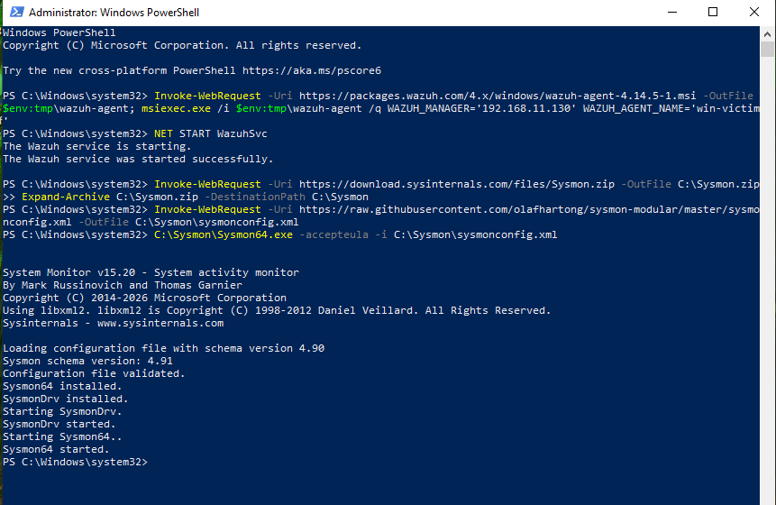
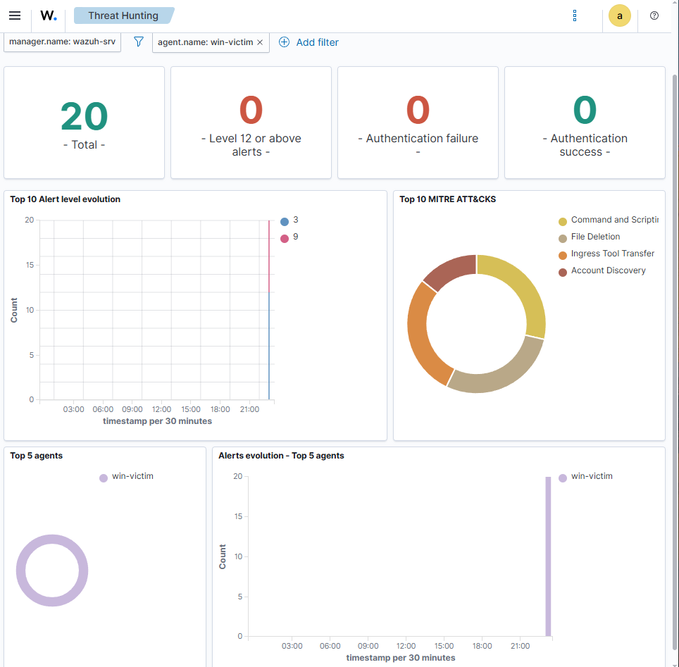

# Scenario 1: Suspicious PowerShell Investigation

## Objective

The objective of this lab was to investigate suspicious PowerShell activity on a Windows VM using Wazuh, Sysmon, and Windows event logs.

This lab was designed to simulate a basic endpoint investigation workflow, similar to what a SOC analyst may perform when reviewing suspicious command-line activity.

---

## Tools Used

- Wazuh
- Wazuh Dashboard
- VMware Workstation Pro
- Windows VM
- Wazuh Windows agent
- Sysmon
- PowerShell
- Windows Event Logs

---

## Lab Summary

In this scenario, PowerShell activity was generated on a Windows VM and investigated through the Wazuh dashboard.

Sysmon was used to improve endpoint visibility by collecting detailed Windows event data. Wazuh was then used to search and review the activity from a central dashboard.

PowerShell is a legitimate Windows administration tool, but it is also commonly abused by attackers because it can be used to execute commands, run scripts, download files, and interact with the operating system without needing additional malware tools.

The purpose of this lab was to understand how PowerShell-related activity can appear inside Wazuh and how endpoint telemetry can be reviewed during a basic security investigation.

---

## Investigation Steps

1. Confirmed that the Windows VM was connected to the Wazuh manager.
2. Verified that the Wazuh Windows agent service was running.
3. Installed and configured Sysmon on the Windows VM.
4. Generated PowerShell activity on the Windows machine.
5. Opened the Wazuh dashboard.
6. Searched for PowerShell-related activity.
7. Reviewed Sysmon and Windows event log data.
8. Captured screenshots as evidence of the investigation.

---

## Evidence Collected

### Wazuh Agents

This screenshot shows the Wazuh dashboard displaying connected agent information.

### Wazuh Dashboard

This screenshot shows the main Wazuh dashboard used during the investigation.

### Sysmon Installed

This screenshot shows Sysmon installed on the Windows VM, improving endpoint visibility.

### Sysmon Search Results

This screenshot shows Sysmon-related event data being reviewed in the Wazuh dashboard.

During the investigation, PowerShell-related activity was visible inside the Wazuh dashboard.

The investigation also showed Sysmon event data from the Windows VM, confirming that endpoint activity was being collected and sent to Wazuh.

Some fields commonly shown in tutorials, such as:

- `data.win.system.channel`
- `data.win.system.eventID`
- `data.win.eventdata.image`
- `data.win.eventdata.commandLine`
- `rule.description`

were not clearly visible in my dashboard view during this lab.

This may have been caused by differences in the Sysmon configuration, Wazuh field parsing, dashboard view, or the specific event type generated during testing.

This was still useful because it showed that real investigations do not always match tutorials exactly. Analysts often need to work with the available data and adapt their investigation based on what is actually present.

---

## Security Relevance

PowerShell activity is important to investigate because attackers often use it as part of living-off-the-land techniques.

Living-off-the-land means using tools that already exist on the system instead of bringing obvious malware onto the machine. This can make malicious activity harder to detect.

Suspicious PowerShell activity may indicate:

- Malware execution
- Script-based attacks
- Credential access attempts
- Remote command execution
- Persistence activity
- Downloading files from the internet
- Reconnaissance on the local system

Because PowerShell is also used by legitimate administrators, it is important to review the context of the command, the user account, the parent process, and the system involved before deciding whether the activity is malicious.

---

## Findings

The lab successfully showed that the Windows VM was sending security event data into Wazuh.

PowerShell-related activity could be searched and reviewed inside the Wazuh dashboard.

Sysmon improved the level of endpoint visibility available for investigation.

Although not all expected event fields appeared exactly as expected, useful event data was still available and the investigation could continue.

---

## Analyst Notes

This lab helped me understand the basic process of investigating endpoint activity using Wazuh.

The main lesson from this scenario was that detection data can vary depending on how tools are configured. In a real-world environment, an analyst may not always see the exact fields shown in documentation or tutorials.

Instead of assuming the lab has failed, the correct approach is to review the available fields, search around the event data, and use screenshots or logs to support the investigation.

This scenario also showed why Sysmon is valuable. Windows logs alone can provide useful information, but Sysmon adds more detailed process and endpoint telemetry, which can improve detection and investigation.

---

## Conclusion

This scenario demonstrated a basic suspicious PowerShell investigation using Wazuh and Sysmon.

The lab confirmed that endpoint activity from a Windows VM could be collected, searched, and reviewed through the Wazuh dashboard.

This forms a useful beginner-level SOC investigation workflow and provides evidence of practical experience with endpoint monitoring, log analysis, and security event investigation.

---

## Skills Demonstrated

- Wazuh dashboard investigation
- Windows endpoint monitoring
- Sysmon log collection
- PowerShell activity analysis
- Basic SOC investigation workflow
- Security event searching
- Evidence collection through screenshots
- Understanding of living-off-the-land techniques

---

## Repository Screenshot Status

The screenshots linked above are the repository image files I could verify by exact filename. The repository also contains additional Wazuh lab screenshots uploaded at the same time, but their displayed names are truncated in the GitHub view. Those can be linked once their exact filenames are visible.
