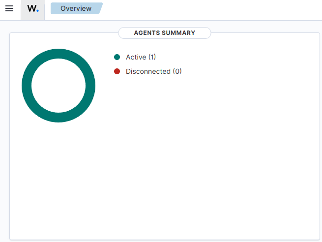
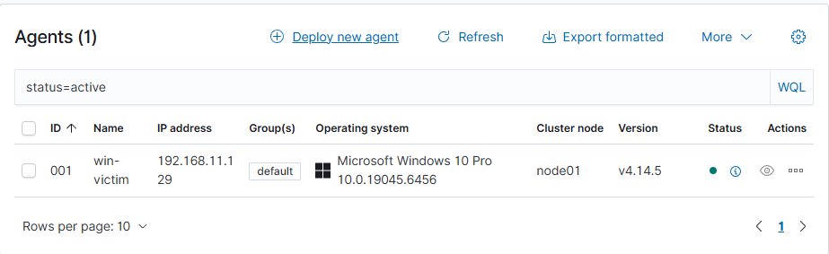
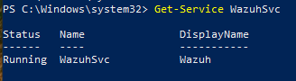
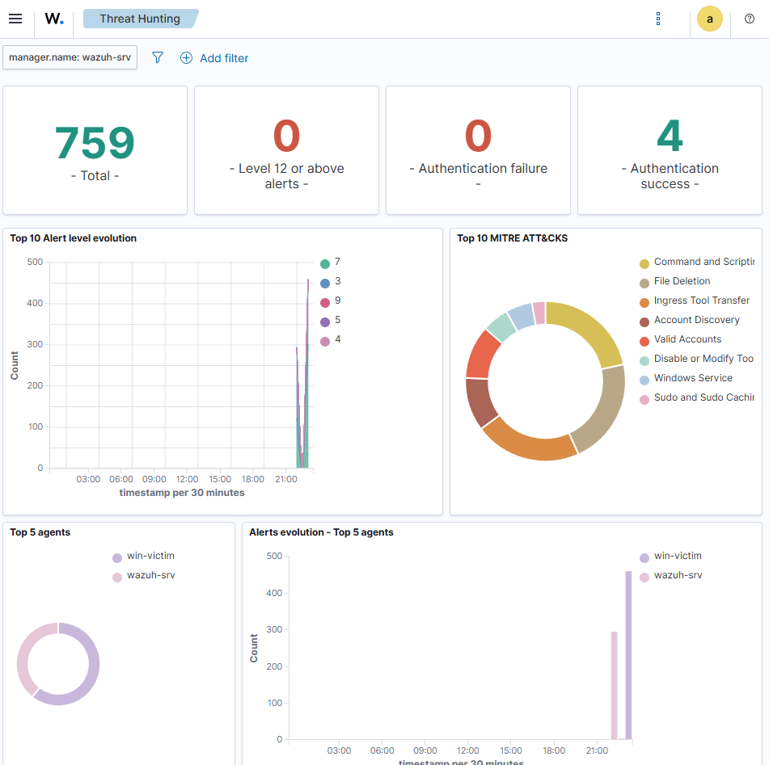
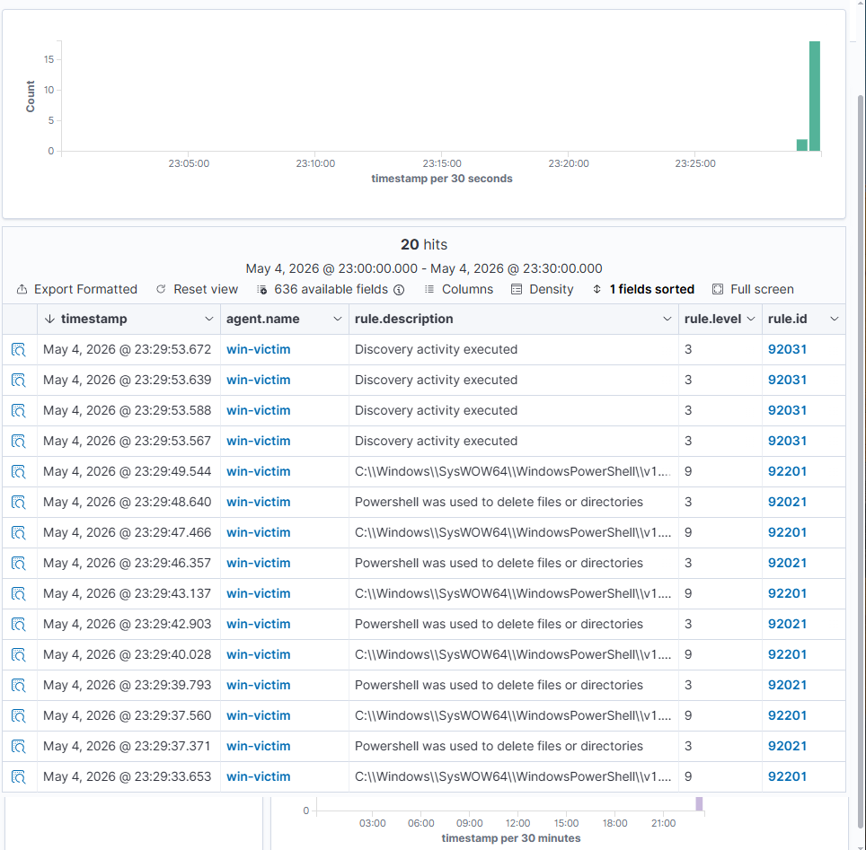
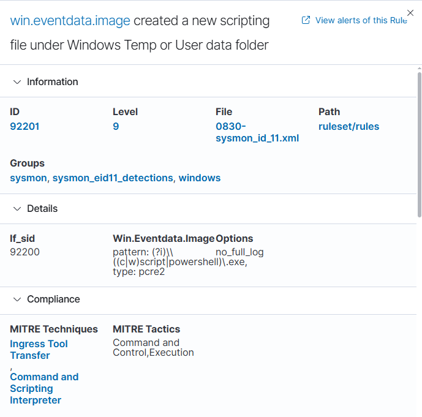

# Scenario 1: Suspicious PowerShell Investigation

## Objective

The objective of this lab was to investigate suspicious PowerShell activity on a Windows VM using Wazuh, Sysmon, and Windows event logs.

This lab was designed to simulate a basic endpoint investigation workflow, similar to what a SOC analyst may perform when reviewing suspicious command-line activity.

---

## Tools Used

- Wazuh
- Wazuh Dashboard
- VMware Workstation Pro
- Windows VM
- Wazuh Windows agent
- Sysmon
- PowerShell
- Windows Event Logs

---

## Lab Summary

In this scenario, PowerShell activity was generated on a Windows VM and investigated through the Wazuh dashboard.

Sysmon was used to improve endpoint visibility by collecting detailed Windows event data. Wazuh was then used to search and review the activity from a central dashboard.

PowerShell is a legitimate Windows administration tool, but it is also commonly abused by attackers because it can be used to execute commands, run scripts, download files, and interact with the operating system without needing additional malware tools.

The purpose of this lab was to understand how PowerShell-related activity can appear inside Wazuh and how endpoint telemetry can be reviewed during a basic security investigation.

---

## Investigation Steps

1. Confirmed that the Windows VM was connected to the Wazuh manager.
2. Verified that the Wazuh Windows agent service was running.
3. Installed and configured Sysmon on the Windows VM.
4. Generated PowerShell activity on the Windows machine.
5. Opened the Wazuh dashboard.
6. Searched for PowerShell-related activity.
7. Reviewed Wazuh threat hunting alerts from the Windows victim machine.
8. Expanded Sysmon event details to inspect rule and event data.
9. Captured screenshots as evidence of the investigation.

---

## Evidence Collected

### 01 - Wazuh Dashboard

This screenshot shows the main Wazuh dashboard used during the investigation.

### 02 - Windows Agent Service Started

This screenshot shows the Wazuh Windows agent service running on the Windows VM.

### 03 - Sysmon Installed

This screenshot shows Sysmon installed on the Windows VM, improving endpoint visibility.

### 04 - Wazuh Service Running After Sysmon Configuration

This screenshot shows the Wazuh service running after Sysmon configuration was applied.

### 05 - Threat Hunting Alerts

This screenshot shows Wazuh threat hunting alerts from the Windows victim machine.

### 06 - Sysmon Search Results

This screenshot shows Sysmon-related event data being reviewed in the Wazuh dashboard.

### 07 - PowerShell Alerts in Wazuh

This screenshot shows PowerShell-related alerts from the Windows victim machine inside the Wazuh dashboard.

### 08 - Expanded Sysmon Rule Details

This screenshot shows the expanded Sysmon event details, including Wazuh rule information for rule `92201`.

During the investigation, PowerShell-related activity was visible inside the Wazuh dashboard.

The investigation also showed Sysmon event data from the Windows VM, confirming that endpoint activity was being collected and sent to Wazuh.

The expanded event view provided more detail than the summary table view. In the summary view, some fields were not immediately visible, but by expanding the event it was possible to inspect more detailed rule and event information.

This was useful because it showed that real investigations do not always match tutorials exactly. Analysts often need to expand events, adjust dashboard columns, and review the available fields before deciding what evidence is useful.

---

## Security Relevance

PowerShell activity is important to investigate because attackers often use it as part of living-off-the-land techniques.

Living-off-the-land means using tools that already exist on the system instead of bringing obvious malware onto the machine. This can make malicious activity harder to detect.

Suspicious PowerShell activity may indicate:

- Malware execution
- Script-based attacks
- Credential access attempts
- Remote command execution
- Persistence activity
- Downloading files from the internet
- Reconnaissance on the local system

Because PowerShell is also used by legitimate administrators, it is important to review the context of the command, the user account, the parent process, the rule triggered, and the system involved before deciding whether the activity is malicious.

---

## Findings

The lab successfully showed that the Windows VM was sending security event data into Wazuh.

PowerShell-related activity could be searched and reviewed inside the Wazuh dashboard.

Sysmon improved the level of endpoint visibility available for investigation.

Wazuh threat hunting showed alerts from the Windows victim machine, and the expanded event view showed more detailed Sysmon rule information, including rule `92201`.

Although the summary dashboard view did not show every useful field immediately, useful event data was available after expanding the relevant alert.

---

## Analyst Notes

This lab helped me understand the basic process of investigating endpoint activity using Wazuh.

The main lesson from this scenario was that detection data can vary depending on how tools are configured and how the dashboard is displaying event fields. In a real-world environment, an analyst may need to expand alerts or adjust visible columns to find the most useful information.

Instead of assuming the lab has failed when fields are not immediately visible, the correct approach is to inspect the full event, search around the event data, and use screenshots or logs to support the investigation.

This scenario also showed why Sysmon is valuable. Windows logs alone can provide useful information, but Sysmon adds more detailed process and endpoint telemetry, which can improve detection and investigation.

---

## Conclusion

This scenario demonstrated a basic suspicious PowerShell investigation using Wazuh and Sysmon.

The lab confirmed that endpoint activity from a Windows VM could be collected, searched, expanded, and reviewed through the Wazuh dashboard.

This forms a useful beginner-level SOC investigation workflow and provides evidence of practical experience with endpoint monitoring, log analysis, alert review, and security event investigation.

---

## Skills Demonstrated

- Wazuh dashboard investigation
- Windows endpoint monitoring
- Sysmon log collection
- PowerShell activity analysis
- Basic SOC investigation workflow
- Security event searching
- Alert expansion and rule review
- Evidence collection through screenshots
- Understanding of living-off-the-land techniques
